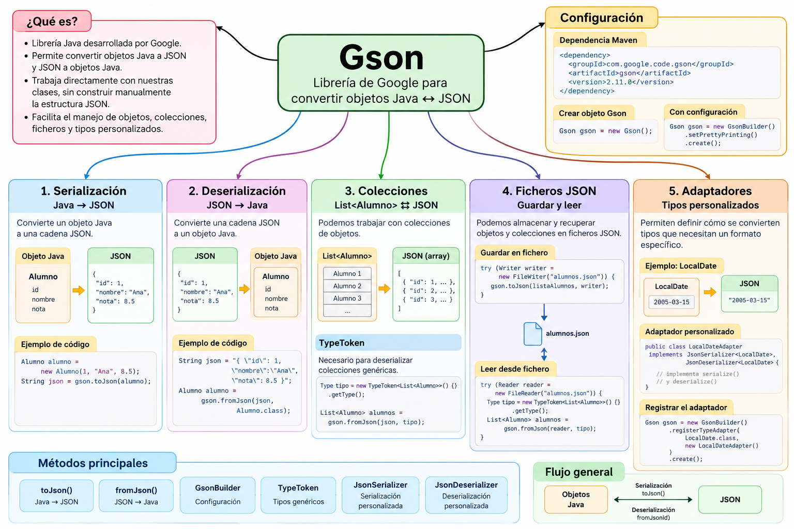

# Gson

### Introducción

**Gson** es una librería Java desarrollada por Google que permite convertir objetos Java a formato JSON y realizar el proceso contrario.

Su principal característica es que permite trabajar directamente con nuestros **objetos Java**, sin necesidad de construir manualmente cada propiedad del documento JSON.

Podemos resumir su funcionamiento así:

```text
Objeto Java
     │
     │ serialización
     ▼
    JSON
     │
     │ deserialización
     ▼
Objeto Java
```

Por ejemplo, partiendo de un objeto:

```java
Alumno alumno =
        new Alumno(
            1,
            "Ana",
            8.5
        );
```

Gson puede generar automáticamente:

```json
{
  "id": 1,
  "nombre": "Ana",
  "nota": 8.5
}
```

Y también puede realizar el proceso contrario:

```text
JSON
 ↓
Gson
 ↓
Alumno
```

---

### Mapa conceptual de Gson



## ¿Qué aprenderemos?

A lo largo de este minicurso aprenderemos a utilizar Gson progresivamente:

```text
Gson
 │
 ├── Configuración del proyecto
 │
 ├── Serialización
 │      Java → JSON
 │
 ├── Deserialización
 │      JSON → Java
 │
 ├── Colecciones
 │      List<Alumno> ⇄ JSON
 │
 ├── TypeToken
 │
 ├── Ficheros
 │      Guardar y leer JSON
 │
 └── Adaptadores
        LocalDate ⇄ JSON
```

---

## ¿Por qué estudiamos Gson después de org.json?

Con `org.json` hemos aprendido a trabajar directamente con la estructura de un documento JSON.

Por ejemplo:

```java
JSONObject alumno =
        new JSONObject();

alumno.put(
    "id",
    1
);

alumno.put(
    "nombre",
    "Ana"
);

alumno.put(
    "nota",
    8.5
);
```

Nosotros mismos construimos cada propiedad.

Con Gson podemos trabajar de otra forma:

```java
Alumno alumno =
        new Alumno(
            1,
            "Ana",
            8.5
        );

String json =
        gson.toJson(alumno);
```

Por tanto:

```text
org.json
   │
   ▼
manipulación explícita
de la estructura JSON
```

frente a:

```text
Gson
   │
   ▼
conversión entre
objetos Java y JSON
```

Haber trabajado primero con `org.json` nos permite comprender mejor qué trabajo está automatizando Gson.

---

## Conceptos fundamentales

### Serialización

La **serialización** consiste en convertir un objeto Java a JSON.

```text
JAVA ─────────────► JSON
```

Con Gson utilizaremos principalmente:

```java
toJson()
```

Por ejemplo:

```java
String json =
        gson.toJson(alumno);
```

---

### Deserialización

La **deserialización** realiza el proceso contrario:

```text
JAVA ◄───────────── JSON
```

Con Gson utilizaremos:

```java
fromJson()
```

Por ejemplo:

```java
Alumno alumno =
        gson.fromJson(
            json,
            Alumno.class
        );
```

!!! important
    Dos de los métodos fundamentales que debemos recordar al trabajar con Gson son:

    ```text
    toJson()      Java → JSON

    fromJson()    JSON → Java
    ```

---

## Clases y elementos principales

Durante este minicurso utilizaremos principalmente:

| Clase / método | Función |
|---|---|
| `Gson` | Realiza las conversiones Java ⇄ JSON |
| `GsonBuilder` | Permite configurar el objeto Gson |
| `toJson()` | Serializa Java → JSON |
| `fromJson()` | Deserializa JSON → Java |
| `TypeToken` | Permite describir tipos genéricos como `List<Alumno>` |
| `JsonSerializer` | Personaliza la serialización |
| `JsonDeserializer` | Personaliza la deserialización |

---

## Gson

La clase principal de la librería es:

```java
Gson
```

Podemos crear un objeto mediante:

```java
Gson gson =
        new Gson();
```

A partir de ese objeto podremos realizar operaciones como:

```java
gson.toJson(...)
```

y:

```java
gson.fromJson(...)
```

---

## GsonBuilder

Cuando necesitamos configurar el comportamiento de Gson utilizamos:

```java
GsonBuilder
```

Por ejemplo:

```java
Gson gson =
        new GsonBuilder()
            .setPrettyPrinting()
            .create();
```

Con:

```java
setPrettyPrinting()
```

podemos obtener un JSON más legible.

En lugar de:

```json
{"id":1,"nombre":"Ana","nota":8.5}
```

podemos obtener:

```json
{
  "id": 1,
  "nombre": "Ana",
  "nota": 8.5
}
```

---

## Trabajar con nuestros modelos Java

Una de las principales ventajas de Gson es que podemos trabajar directamente con clases de nuestra aplicación.

Por ejemplo:

```java
public class Alumno {

    private int id;
    private String nombre;
    private double nota;

    // constructores
    // getters
    // setters
}
```

Gson puede relacionar automáticamente:

```text
JAVA                    JSON

id          ◄───────►   "id"

nombre      ◄───────►   "nombre"

nota        ◄───────►   "nota"
```

De esta forma podemos trabajar con nuestros objetos Java en lugar de manipular continuamente propiedades JSON.

---

## Objetos anidados

Nuestros modelos pueden contener otros objetos.

Por ejemplo:

```text
Alumno
 │
 ├── id
 ├── nombre
 ├── nota
 │
 └── direccion
       │
       ├── ciudad
       └── codigoPostal
```

Gson puede convertir esta estructura en un JSON anidado:

```json
{
  "id": 1,
  "nombre": "Ana",
  "nota": 8.5,
  "direccion": {
    "ciudad": "Alcalá de Henares",
    "codigoPostal": "28801"
  }
}
```

---

## Colecciones

También podemos trabajar con colecciones de objetos.

Por ejemplo:

```java
List<Alumno>
```

puede convertirse en:

```json
[
  {
    "id": 1,
    "nombre": "Ana",
    "nota": 8.5
  },
  {
    "id": 2,
    "nombre": "Luis",
    "nota": 7.2
  }
]
```

Podemos resumir:

```text
List<Alumno>
      │
      │ Gson
      ▼
  array JSON
```

---

## TypeToken

Cuando queremos deserializar una colección genérica como:

```java
List<Alumno>
```

necesitamos proporcionar a Gson información sobre ese tipo.

Para ello utilizaremos:

```java
TypeToken
```

Por ejemplo:

```java
Type tipo =
        new TypeToken<List<Alumno>>() {}
            .getType();
```

y posteriormente:

```java
List<Alumno> alumnos =
        gson.fromJson(
            json,
            tipo
        );
```

!!! note
    `TypeToken` no realiza la conversión.

    Su función es describir a Gson un tipo genérico como:

    ```java
    List<Alumno>
    ```

---

## Trabajar con ficheros

Además de convertir objetos en memoria, podemos utilizar Gson para almacenar los datos en ficheros JSON.

El flujo será:

```text
OBJETOS JAVA
     │
     ▼
    Gson
     │
     ▼
   Writer
     │
     ▼
FICHERO JSON
```

Por ejemplo:

```text
List<Alumno>
     │
     ▼
    Gson
     │
     ▼
alumnos.json
```

Y posteriormente podremos realizar el proceso contrario:

```text
alumnos.json
     │
     ▼
   Reader
     │
     ▼
    Gson
     │
     ▼
List<Alumno>
```

---

## Tipos que necesitan una conversión personalizada

No todos los tipos tienen por qué representarse exactamente de la forma que queremos.

En este minicurso veremos el ejemplo de:

```java
LocalDate
```

Queremos convertir:

```text
LocalDate
2005-03-15
```

en:

```json
"2005-03-15"
```

y también realizar el proceso contrario.

Para ello crearemos un adaptador:

```text
LocalDateAdapter
```

que utilizará:

```java
JsonSerializer<LocalDate>
```

y:

```java
JsonDeserializer<LocalDate>
```

---

## Registrar un adaptador

Indicaremos a Gson que debe utilizar nuestro adaptador mediante:

```java
Gson gson =
        new GsonBuilder()
            .registerTypeAdapter(
                LocalDate.class,
                new LocalDateAdapter()
            )
            .setPrettyPrinting()
            .create();
```

Conceptualmente:

```text
                  Gson
                   │
                   │ encuentra LocalDate
                   ▼
            LocalDateAdapter
              /          \
             ▼            ▼
       serialize()   deserialize()
             │            │
             ▼            ▼
          JSON         LocalDate
```

---

## Mapa del minicurso

El recorrido que seguiremos será:

```text
                            GSON
                             │
                             ▼
                    1. PREPARACIÓN
                             │
                             ▼
                     Maven + Gson
                             │
                             ▼
                    2. SERIALIZACIÓN
                             │
                             ▼
                       Java → JSON
                             │
                             ▼
                  3. DESERIALIZACIÓN
                             │
                             ▼
                       JSON → Java
                             │
                             ▼
                    4. COLECCIONES
                             │
                             ▼
              List<Alumno> + TypeToken
                             │
                             ▼
                      5. FICHEROS
                             │
                  ┌──────────┴──────────┐
                  ▼                     ▼
               GUARDAR                 LEER
                  │                     │
                  └──────────┬──────────┘
                             ▼
                      alumnos.json
                             │
                             ▼
                    6. ADAPTADORES
                             │
                             ▼
                 LocalDate ⇄ JSON
                             │
                             ▼
                       7. RESUMEN
```

---

## Objetivos del minicurso

Al finalizar este bloque deberías ser capaz de:

- configurar Gson en un proyecto Maven;
- comprender la diferencia entre serialización y deserialización;
- convertir objetos Java a JSON;
- convertir JSON en objetos Java;
- utilizar `Gson` y `GsonBuilder`;
- trabajar con clases que representan modelos de datos;
- serializar colecciones;
- deserializar colecciones mediante `TypeToken`;
- guardar objetos y colecciones en ficheros JSON;
- recuperar objetos desde ficheros JSON;
- comprender cuándo necesitamos personalizar una conversión;
- crear y registrar un adaptador para `LocalDate`.

---

## Proyecto de ejemplos

Todos los ejemplos de este minicurso están incluidos en un único **proyecto Maven**, preparado para:

```text
Java 21
+
Maven
+
Gson 2.11.0
```

[📦 **Descargar proyecto Maven completo de Gson**](../../../../descargas/ut1/java-json/gson-ejemplos.zip)

El proyecto contiene:

```text
gson-ejemplos/
│
├── pom.xml
├── README.md
│
├── data/
│   └── alumnos.json
│
└── src/main/java/com/example/
    ├── Alumno.java
    ├── DemoGson.java
    ├── DemoListaGson.java
    ├── GuardarAlumnosGson.java
    ├── LeerAlumnosGson.java
    ├── LocalDateAdapter.java
    └── DemoLocalDateGson.java
```

### Ejemplos incluidos

| Fichero | Contenido |
|---|---|
| `Alumno.java` | Modelo de datos utilizado en los ejemplos |
| `DemoGson.java` | Serialización y deserialización de un objeto |
| `DemoListaGson.java` | Serialización y deserialización de `List<Alumno>` mediante `TypeToken` |
| `GuardarAlumnosGson.java` | Guardar una colección en `data/alumnos.json` |
| `LeerAlumnosGson.java` | Recuperar una colección desde `data/alumnos.json` |
| `LocalDateAdapter.java` | Adaptador personalizado para `LocalDate` |
| `DemoLocalDateGson.java` | Serialización y deserialización utilizando el adaptador |

!!! tip "Proyecto descargable"
    Descarga y descomprime el proyecto para abrirlo directamente desde VS Code.

    El `pom.xml` ya incluye la dependencia de **Gson 2.11.0** y está configurado para utilizar **Java 21**.

---

## Orden recomendado

Para seguir los ejemplos del proyecto podemos utilizar este recorrido:

```text
DemoGson.java
      │
      ▼
Objeto Java ⇄ JSON
      │
      ▼
DemoListaGson.java
      │
      ▼
List<Alumno> ⇄ JSON
      │
      ▼
GuardarAlumnosGson.java
      │
      ▼
data/alumnos.json
      │
      ▼
LeerAlumnosGson.java
      │
      ▼
List<Alumno>
      │
      ▼
LocalDateAdapter.java
      +
DemoLocalDateGson.java
      │
      ▼
LocalDate ⇄ JSON
```

---

## Contenidos del minicurso

### 1. Preparación del proyecto

Configuraremos un proyecto Maven para utilizar:

```text
Java 21
+
Gson 2.11.0
```

y realizaremos nuestro primer ejemplo con Gson.

---

### 2. Serialización

Aprenderemos a realizar:

```text
Objeto Java
     │
     │ toJson()
     ▼
    JSON
```

---

### 3. Deserialización

Realizaremos el proceso contrario:

```text
JSON
 │
 │ fromJson()
 ▼
Objeto Java
```

---

### 4. Colecciones y TypeToken

Trabajaremos con:

```java
List<Alumno>
```

y aprenderemos por qué necesitamos:

```java
TypeToken
```

para recuperar colecciones genéricas.

---

### 5. Ficheros JSON

Completaremos el ciclo de persistencia:

```text
List<Alumno>
     │
     ▼
alumnos.json
     │
     ▼
List<Alumno>
```

utilizando `Writer`, `Reader`, `toJson()` y `fromJson()`.

---

### 6. Adaptadores personalizados

Aprenderemos a definir reglas de conversión para tipos como:

```java
LocalDate
```

mediante:

```java
JsonSerializer
```

y:

```java
JsonDeserializer
```

---

### 7. Resumen

Terminaremos con una página de referencia rápida que reúne:

- clases principales;
- métodos fundamentales;
- `toJson()` y `fromJson()`;
- `GsonBuilder`;
- `TypeToken`;
- ficheros;
- adaptadores;
- comparación entre `org.json` y Gson;
- recorrido completo de los ejemplos.

---

!!! success "Objetivo final"
    Al terminar este minicurso podremos pasar de trabajar manualmente con la estructura JSON a trabajar directamente con nuestros modelos Java:

    ```text
                    GSON

    OBJETOS JAVA ───────────────► JSON
                 serialización

    OBJETOS JAVA ◄─────────────── JSON
                deserialización
    ```

    y podremos aplicar el mismo mecanismo a **objetos, colecciones, ficheros y tipos personalizados**.