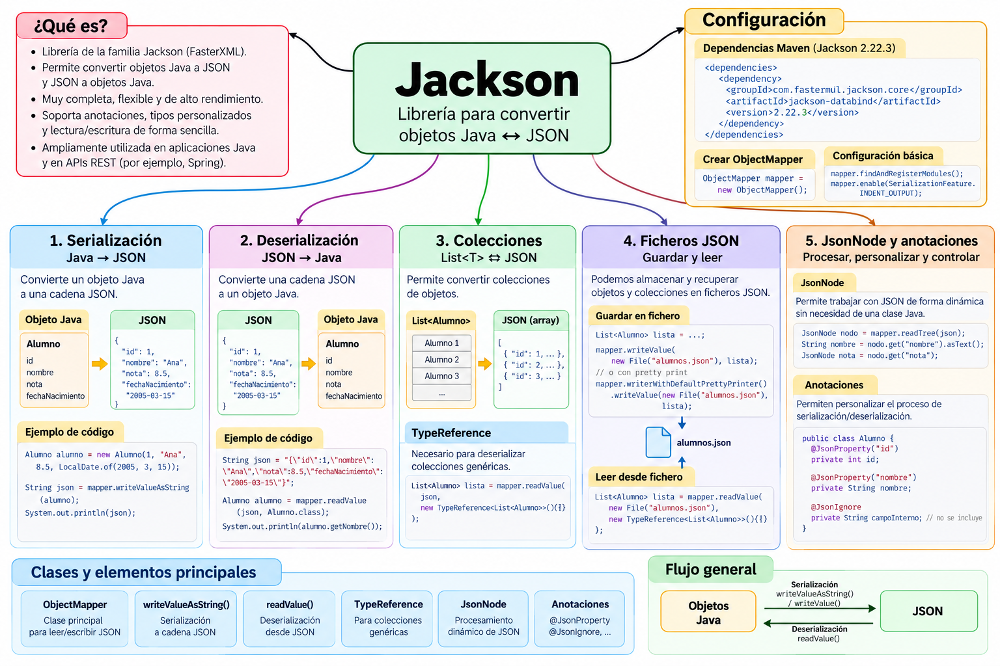

# Jackson

### Introducción

**Jackson** es una librería Java muy utilizada para trabajar con datos en formato JSON.

Al igual que Gson, permite convertir automáticamente **objetos Java en JSON** y realizar el proceso contrario.

La clase central que utilizaremos es:

```java
ObjectMapper
```

Podemos representar el funcionamiento básico de Jackson así:

```text
Objeto Java
     │
     │ serialización
     ▼
    JSON
     │
     │ deserialización
     ▼
Objeto Java
```

Por ejemplo, partiendo de un objeto Java:

```java
Alumno alumno =
        new Alumno(
            1,
            "Ana",
            8.5
        );
```

Jackson puede generar un documento JSON equivalente:

```json
{
  "id": 1,
  "nombreCompleto": "Ana",
  "nota": 8.5
}
```

También podemos realizar el proceso contrario y recuperar un objeto Java a partir de un JSON.

---

### Mapa conceptual de Jackson



---

## ¿Por qué estudiamos Jackson?

En este bloque hemos utilizado diferentes formas de trabajar con JSON desde Java.

Primero utilizamos **org.json**, donde manipulamos directamente la estructura JSON:

```java
JSONObject alumno = new JSONObject();

alumno.put("id", 1);
alumno.put("nombre", "Ana");
alumno.put("nota", 8.5);
```

Después utilizamos **Gson**, que permite convertir directamente objetos Java:

```java
String json =
        gson.toJson(alumno);
```

Jackson sigue una filosofía similar, pero utiliza como elemento central:

```java
ObjectMapper
```

Por ejemplo:

```java
String json =
        mapper.writeValueAsString(alumno);
```

Podemos resumir las tres aproximaciones:

```text
org.json
   │
   ▼
Manipulación explícita
de la estructura JSON


Gson
   │
   ▼
Objetos Java ⇄ JSON
mediante Gson


Jackson
   │
   ▼
Objetos Java ⇄ JSON
mediante ObjectMapper
```

Estudiar las tres librerías nos permitirá reconocer diferentes formas de resolver el mismo problema.

---

## Conceptos fundamentales

### Serialización

La **serialización** consiste en convertir un objeto Java en una representación JSON.

```text
JAVA ─────────────► JSON
```

Con Jackson utilizaremos principalmente:

```java
writeValueAsString()
```

Por ejemplo:

```java
String json =
        mapper.writeValueAsString(alumno);
```

---

### Deserialización

La **deserialización** realiza el proceso contrario:

```text
JAVA ◄───────────── JSON
```

Con Jackson utilizaremos principalmente:

```java
readValue()
```

Por ejemplo:

```java
Alumno alumno =
        mapper.readValue(
            json,
            Alumno.class
        );
```

!!! important
    Dos operaciones fundamentales que debemos recordar son:

    ```text
    writeValueAsString()     Java → JSON

    readValue()              JSON → Java
    ```

---

## ObjectMapper

La clase que utilizaremos continuamente al trabajar con Jackson es:

```java
ObjectMapper
```

Para crearla:

```java
ObjectMapper mapper =
        new ObjectMapper();
```

A partir de este objeto podremos realizar las principales operaciones de serialización y deserialización.

Por ejemplo:

```java
mapper.writeValueAsString(alumno);
```

o:

```java
mapper.readValue(
    json,
    Alumno.class
);
```

Podemos visualizarlo así:

```text
                 ObjectMapper
                /            \
               /              \
              ▼                ▼

        Objeto Java           JSON
              │                │
              └────── ⇄ ───────┘
```

---

## Clases y elementos principales

Durante este minicurso utilizaremos principalmente:

| Clase / método | Función |
|---|---|
| `ObjectMapper` | Clase principal para trabajar con JSON |
| `writeValueAsString()` | Convierte un objeto Java en una cadena JSON |
| `readValue()` | Convierte JSON en objetos Java |
| `writeValue()` | Escribe directamente datos JSON en un fichero |
| `TypeReference` | Permite describir tipos genéricos como `List<Alumno>` |
| `JsonNode` | Permite trabajar con JSON como un árbol de nodos |
| `readTree()` | Convierte un JSON en un árbol `JsonNode` |
| `@JsonProperty` | Permite modificar el nombre utilizado en JSON |
| `@JsonIgnore` | Permite excluir una propiedad del JSON |

---

## Trabajar con nuestros modelos Java

Jackson puede trabajar directamente con las clases de nuestra aplicación.

Por ejemplo:

```java
public class Alumno {

    private int id;
    private String nombre;
    private double nota;

    public Alumno() {
    }

    // constructores
    // getters
    // setters
}
```

Jackson puede relacionar las propiedades del objeto con las propiedades del JSON.

Conceptualmente:

```text
JAVA                         JSON

id            ◄────────►     "id"

nombre        ◄────────►     "nombre"

nota          ◄────────►     "nota"
```

Esto permite trabajar normalmente con nuestros objetos Java y utilizar Jackson cuando necesitamos convertirlos a JSON.

---

## Colecciones

Jackson también permite serializar colecciones.

Por ejemplo:

```java
List<Alumno>
```

puede convertirse en:

```json
[
  {
    "id": 1,
    "nombreCompleto": "Ana",
    "nota": 8.5
  },
  {
    "id": 2,
    "nombreCompleto": "Luis",
    "nota": 7.2
  }
]
```

La serialización es sencilla:

```java
String json =
        mapper.writeValueAsString(alumnos);
```

---

## TypeReference

Al deserializar colecciones necesitamos conservar información sobre el tipo de los elementos.

Por ejemplo:

```java
List<Alumno>
```

Para ello Jackson proporciona:

```java
TypeReference
```

Podemos escribir:

```java
List<Alumno> alumnos =
        mapper.readValue(
            json,
            new TypeReference<List<Alumno>>() {}
        );
```

!!! note
    `TypeReference` cumple en Jackson una función parecida a la que realizaba `TypeToken` cuando trabajábamos con Gson.

Podemos comparar:

```text
Gson                         Jackson

TypeToken                    TypeReference
   │                              │
   ▼                              ▼
List<Alumno>                  List<Alumno>
```

---

## Trabajar con ficheros

Jackson puede leer y escribir directamente ficheros JSON.

Para guardar:

```java
mapper.writeValue(
    fichero.toFile(),
    alumnos
);
```

El flujo será:

```text
List<Alumno>
     │
     ▼
ObjectMapper
     │
     ▼
 writeValue()
     │
     ▼
alumnos.json
```

Para leer:

```java
List<Alumno> alumnos =
        mapper.readValue(
            fichero.toFile(),
            new TypeReference<List<Alumno>>() {}
        );
```

El proceso completo será:

```text
OBJETOS JAVA
     │
     ▼
ObjectMapper
     │
     ▼
FICHERO JSON
     │
     ▼
ObjectMapper
     │
     ▼
OBJETOS JAVA
```

---

## JsonNode

Jackson también permite trabajar directamente con la estructura de un JSON sin convertirlo inmediatamente en una clase Java.

Para ello utilizaremos:

```java
JsonNode
```

Por ejemplo:

```java
JsonNode raiz =
        mapper.readTree(json);
```

Después podemos consultar propiedades:

```java
raiz.get("nombreCompleto").asText();
```

o:

```java
raiz.get("nota").asDouble();
```

Conceptualmente:

```text
JSON
 │
 │ readTree()
 ▼
JsonNode
 │
 ├── get("id")
 ├── get("nombreCompleto")
 └── get("nota")
```

Esta forma de trabajar recuerda en parte a la manipulación directa que realizábamos con `JSONObject`.

---

## Anotaciones

Jackson permite personalizar la conversión mediante **anotaciones**.

En este minicurso veremos dos ejemplos.

### @JsonProperty

Permite indicar el nombre que tendrá una propiedad en el JSON.

Por ejemplo:

```java
@JsonProperty("nombreCompleto")
public String getNombre() {
    return nombre;
}
```

La propiedad Java:

```text
nombre
```

puede aparecer en JSON como:

```json
"nombreCompleto"
```

---

### @JsonIgnore

Permite indicar que una propiedad no debe aparecer en el JSON.

Por ejemplo:

```java
@JsonIgnore
private String observaciones;
```

Aunque el objeto Java tenga:

```text
observaciones
```

Jackson no incluirá esa información en el JSON.

---

## Mapa del minicurso

El recorrido que seguiremos será:

```text
                         JACKSON
                            │
                            ▼
                   1. PREPARACIÓN
                            │
                            ▼
                  Maven + ObjectMapper
                            │
                            ▼
                  2. SERIALIZACIÓN
                            │
                            ▼
                      Java → JSON
                            │
                            ▼
                 3. DESERIALIZACIÓN
                            │
                            ▼
                      JSON → Java
                            │
                            ▼
                   4. COLECCIONES
                            │
                            ▼
             List<Alumno> + TypeReference
                            │
                            ▼
                     5. FICHEROS
                            │
                 ┌──────────┴──────────┐
                 ▼                     ▼
              GUARDAR                 LEER
                 │                     │
                 └──────────┬──────────┘
                            ▼
                     alumnos.json
                            │
                            ▼
              6. JSONNODE Y ANOTACIONES
                            │
                  ┌─────────┴─────────┐
                  ▼                   ▼
              JsonNode          @JsonProperty
                                @JsonIgnore
                            │
                            ▼
                      7. RESUMEN
```

---

## Objetivos del minicurso

Al finalizar este bloque deberías ser capaz de:

- configurar Jackson en un proyecto Maven;
- utilizar `ObjectMapper`;
- comprender la diferencia entre serialización y deserialización;
- convertir objetos Java a JSON;
- convertir JSON en objetos Java;
- trabajar con colecciones;
- utilizar `TypeReference` para tipos genéricos;
- guardar objetos y colecciones en ficheros JSON;
- recuperar objetos desde ficheros JSON;
- trabajar con la estructura de un JSON mediante `JsonNode`;
- utilizar `readTree()`;
- personalizar propiedades mediante anotaciones;
- comprender el uso básico de `@JsonProperty`;
- comprender el uso básico de `@JsonIgnore`;
- comparar las formas de trabajo de `org.json`, Gson y Jackson.

---

## Proyecto de ejemplos

Todos los ejemplos del minicurso están incluidos en un único **proyecto Maven**, preparado para:

```text
Java 21
+
Maven
+
Jackson
```

[📦 **Descargar proyecto Maven completo de Jackson**](../../../../descargas/ut1/java-json/jackson-ejemplos.zip)

El proyecto contiene:

```text
jackson-ejemplos/
│
├── pom.xml
├── README.md
│
├── data/
│   └── alumnos.json
│
└── src/main/java/com/example/
    ├── Alumno.java
    ├── DemoJackson.java
    ├── DemoListaJackson.java
    ├── GuardarAlumnosJackson.java
    ├── LeerAlumnosJackson.java
    ├── DemoJsonNode.java
    └── DemoAnotaciones.java
```

### Ejemplos incluidos

| Fichero | Contenido |
|---|---|
| `Alumno.java` | Modelo utilizado en los ejemplos |
| `DemoJackson.java` | Serialización y deserialización de un objeto |
| `DemoListaJackson.java` | Colecciones y `TypeReference` |
| `GuardarAlumnosJackson.java` | Guarda una colección en `data/alumnos.json` |
| `LeerAlumnosJackson.java` | Recupera una colección desde `data/alumnos.json` |
| `DemoJsonNode.java` | Lectura del JSON mediante el modelo de árbol `JsonNode` |
| `DemoAnotaciones.java` | Uso de `@JsonProperty` y `@JsonIgnore` |

!!! tip "Proyecto descargable"
    Descarga y descomprime el proyecto para abrirlo directamente desde VS Code.

    El `pom.xml` está configurado para utilizar **Java 21** y ya incluye la dependencia necesaria de Jackson.

---

## Orden recomendado de los ejemplos

Podemos seguir este recorrido:

```text
DemoJackson.java
       │
       ▼
Objeto Java ⇄ JSON
       │
       ▼
DemoListaJackson.java
       │
       ▼
List<Alumno> ⇄ JSON
       │
       ▼
GuardarAlumnosJackson.java
       │
       ▼
data/alumnos.json
       │
       ▼
LeerAlumnosJackson.java
       │
       ▼
List<Alumno>
       │
       ▼
DemoJsonNode.java
       │
       ▼
JSON → árbol de nodos
       │
       ▼
DemoAnotaciones.java
       │
       ▼
Personalización del JSON
```

---

## Contenidos del minicurso

### 1. Preparación del proyecto

Configuraremos un proyecto Maven para trabajar con:

```text
Java 21
+
Jackson
```

y conoceremos la clase:

```java
ObjectMapper
```

---

### 2. Serialización

Aprenderemos a realizar:

```text
Objeto Java
     │
     │ writeValueAsString()
     ▼
    JSON
```

---

### 3. Deserialización

Realizaremos el proceso contrario:

```text
JSON
 │
 │ readValue()
 ▼
Objeto Java
```

---

### 4. Colecciones y TypeReference

Trabajaremos con:

```java
List<Alumno>
```

y aprenderemos por qué necesitamos:

```java
TypeReference
```

para recuperar correctamente colecciones genéricas.

---

### 5. Ficheros JSON

Completaremos el ciclo de persistencia:

```text
List<Alumno>
     │
     ▼
alumnos.json
     │
     ▼
List<Alumno>
```

utilizando directamente `ObjectMapper`.

---

### 6. JsonNode y anotaciones

Veremos dos características especialmente interesantes de Jackson.

Por una parte:

```java
JsonNode
```

para trabajar directamente con la estructura del JSON.

Por otra:

```java
@JsonProperty
@JsonIgnore
```

para personalizar la conversión entre Java y JSON.

---

### 7. Resumen

Terminaremos con una página de referencia rápida que reúne:

- `ObjectMapper`;
- `writeValueAsString()`;
- `readValue()`;
- `writeValue()`;
- `TypeReference`;
- ficheros;
- `JsonNode`;
- `readTree()`;
- anotaciones;
- comparación con Gson y `org.json`;
- recorrido completo de los ejemplos.

---

!!! success "Objetivo final"
    Al terminar este minicurso tendremos tres formas diferentes de trabajar con JSON desde Java:

    ```text
    org.json
        │
        └── Manipulación explícita del JSON


    Gson
        │
        └── Objetos Java ⇄ JSON


    Jackson
        │
        └── ObjectMapper
              │
              ├── Objetos Java ⇄ JSON
              ├── Colecciones
              ├── Ficheros
              ├── JsonNode
              └── Anotaciones
    ```

    Esto nos permitirá comprender no solo **cómo utilizar Jackson**, sino también las diferencias entre las distintas alternativas que hemos estudiado para trabajar con JSON desde Java.