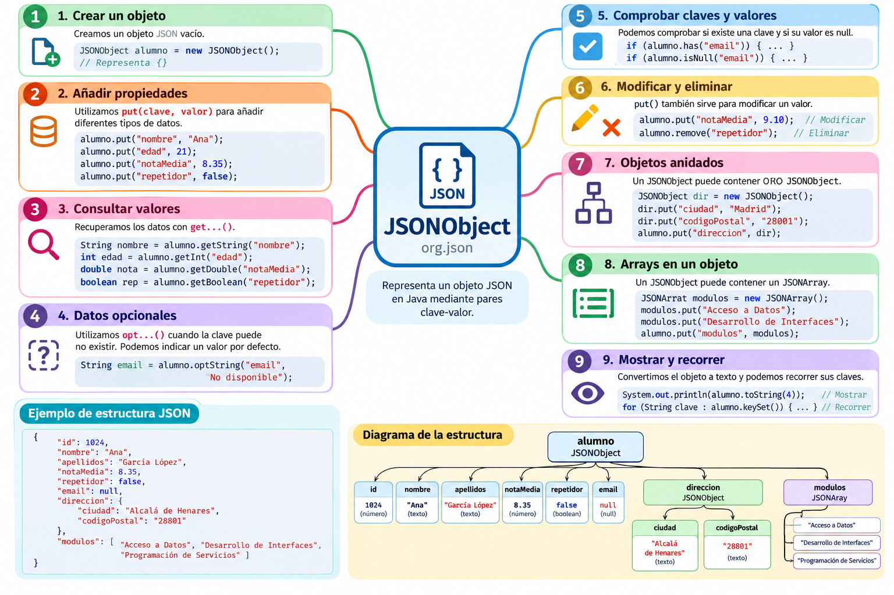

# JSONObject

### 1. Introducción

`JSONObject` es una de las clases principales de la librería **org.json**.

Esta clase permite representar y manipular en Java un **objeto JSON**, es decir, una estructura formada por pares **clave-valor**.

Por ejemplo, el siguiente documento JSON representa los datos de un alumno:

```json
{
    "id": 1024,
    "nombre": "Ana",
    "apellidos": "García López",
    "notaMedia": 8.35,
    "repetidor": false
}
```

Cada dato está formado por una **clave** y un **valor**:

```text
"nombre": "Ana"
    ↑         ↑
  clave     valor
```

En Java podremos representar este objeto mediante:

```java
JSONObject alumno = new JSONObject();
```

y añadir sus propiedades utilizando el método `put()`:

```java
alumno.put("id", 1024);
alumno.put("nombre", "Ana");
alumno.put("apellidos", "García López");
alumno.put("notaMedia", 8.35);
alumno.put("repetidor", false);
```

De esta forma estamos construyendo en Java una estructura que puede representarse como JSON.

!!! info "JSONObject representa un objeto JSON"
    Cuando en un documento JSON encontramos una estructura delimitada por llaves `{ }`, estamos ante un **objeto JSON**.

    Con la librería `org.json`, este tipo de estructura se representa mediante la clase `JSONObject`.

#### ¿Qué aprenderemos?

A lo largo de esta sección aprenderemos a:

- crear objetos JSON;
- añadir propiedades mediante `put()`;
- trabajar con distintos tipos de valores;
- consultar valores mediante `get...()` y `opt...()`;
- comprobar si existen determinadas propiedades;
- trabajar con valores `null`;
- modificar y eliminar propiedades;
- crear objetos JSON anidados;
- incluir arrays dentro de un objeto;
- recorrer las propiedades de un objeto;
- convertir el objeto a texto mediante `toString()`.

---

### 2. Mapa general de JSONObject

El siguiente esquema resume las principales operaciones que podemos realizar con `JSONObject` y muestra cómo puede contener tanto datos simples como otros objetos y arrays.



!!! tip "Utiliza el mapa como guía"
    Puedes volver a este esquema durante la lección para situar cada una de las operaciones que iremos estudiando.

---

### 3. Estructura de un objeto JSON

Un objeto JSON se escribe entre llaves `{ }` y contiene pares:

```text
"clave": valor
```

Un `JSONObject` no tiene por qué contener únicamente datos sencillos.

Por ejemplo:

```json
{
    "id": 1024,
    "nombre": "Ana",
    "apellidos": "García López",
    "notaMedia": 8.35,
    "repetidor": false,
    "email": null,
    "direccion": {
        "ciudad": "Alcalá de Henares",
        "codigoPostal": "28801"
    },
    "modulos": [
        "Acceso a Datos",
        "Desarrollo de Interfaces",
        "Programación de Servicios"
    ]
}
```

En este ejemplo encontramos diferentes tipos de valores:

| Clave | Valor | Tipo |
|---|---|---|
| `id` | `1024` | Número entero |
| `nombre` | `"Ana"` | String |
| `apellidos` | `"García López"` | String |
| `notaMedia` | `8.35` | Número decimal |
| `repetidor` | `false` | Boolean |
| `email` | `null` | Valor nulo |
| `direccion` | `{ ... }` | Objeto JSON |
| `modulos` | `[ ... ]` | Array JSON |

Podemos visualizar su estructura de esta forma:

```text
alumno
│
├── id ────────────── número
├── nombre ────────── texto
├── apellidos ─────── texto
├── notaMedia ─────── número
├── repetidor ─────── boolean
├── email ─────────── null
│
├── direccion ─────── JSONObject
│   ├── ciudad
│   └── codigoPostal
│
└── modulos ───────── JSONArray
    ├── Acceso a Datos
    ├── Desarrollo de Interfaces
    └── Programación de Servicios
```

!!! important "JSON puede ser jerárquico"
    Un documento JSON no tiene por qué ser una colección plana de datos.

    Un objeto puede contener **otros objetos y arrays**, lo que permite representar estructuras de información complejas.

---

### 4. Crear un JSONObject

Para utilizar `JSONObject` debemos importar la clase:

```java
import org.json.JSONObject;
```

Después podemos crear un objeto vacío:

```java
JSONObject alumno = new JSONObject();
```

En este momento `alumno` representa:

```json
{}
```

Podemos comprobarlo:

```java
System.out.println(alumno);
```

---

### 5. Añadir propiedades con `put()`

El método fundamental para construir un `JSONObject` es:

```java
put(clave, valor)
```

Por ejemplo:

```java
JSONObject alumno = new JSONObject();

alumno.put("id", 1024);
alumno.put("nombre", "Ana");
alumno.put("apellidos", "García López");
alumno.put("notaMedia", 8.35);
alumno.put("repetidor", false);
```

Observa que podemos añadir valores de diferentes tipos:

```java
alumno.put("id", 1024);                  // int
alumno.put("nombre", "Ana");             // String
alumno.put("notaMedia", 8.35);           // double
alumno.put("repetidor", false);          // boolean
```

El resultado sería:

```json
{
    "id": 1024,
    "nombre": "Ana",
    "apellidos": "García López",
    "notaMedia": 8.35,
    "repetidor": false
}
```

#### Las claves son únicas

Cada propiedad de un objeto se identifica mediante una clave.

Si hacemos:

```java
alumno.put("nombre", "Ana");
alumno.put("nombre", "Laura");
```

no tendremos dos propiedades llamadas `nombre`.

El segundo `put()` sustituye el valor anterior.

El resultado será:

```json
{
    "nombre": "Laura"
}
```

!!! warning "Una clave identifica una propiedad"
    Utilizar `put()` sobre una clave que ya existe sirve también para **modificar su valor**.

---

### 6. Mostrar un JSONObject

Podemos convertir el objeto a texto mediante:

```java
alumno.toString()
```

Por ejemplo:

```java
System.out.println(alumno.toString());
```

El resultado aparecerá en una única línea:

```json
{"id":1024,"nombre":"Ana","apellidos":"García López","notaMedia":8.35,"repetidor":false}
```

Es JSON válido, pero puede resultar difícil de leer.

Podemos utilizar:

```java
System.out.println(alumno.toString(4));
```

para obtener una representación indentada:

```json
{
    "id": 1024,
    "nombre": "Ana",
    "apellidos": "García López",
    "notaMedia": 8.35,
    "repetidor": false
}
```

El número `4` indica el número de espacios utilizados para la indentación.

!!! tip "Durante el desarrollo"
    `toString(4)` resulta especialmente útil para comprobar visualmente la estructura del JSON que estamos construyendo.

---

### 7. Recuperar datos: métodos `get...()`

Una vez creado el objeto podemos recuperar los valores almacenados.

Por ejemplo:

```java
String nombre = alumno.getString("nombre");
```

Dependiendo del tipo de dato podemos utilizar distintos métodos:

```java
int id = alumno.getInt("id");
String nombre = alumno.getString("nombre");
String apellidos = alumno.getString("apellidos");
double nota = alumno.getDouble("notaMedia");
boolean repetidor = alumno.getBoolean("repetidor");
```

Algunos métodos habituales son:

| Método | Devuelve |
|---|---|
| `getString()` | `String` |
| `getInt()` | `int` |
| `getLong()` | `long` |
| `getDouble()` | `double` |
| `getBoolean()` | `boolean` |
| `getJSONObject()` | `JSONObject` |
| `getJSONArray()` | `JSONArray` |

Por ejemplo:

```java
System.out.println("Alumno: " + alumno.getString("nombre"));
System.out.println("Nota: " + alumno.getDouble("notaMedia"));
```

---

### 8. ¿Qué ocurre si una clave no existe?

Supongamos que intentamos acceder a:

```java
String telefono = alumno.getString("telefono");
```

pero nuestro JSON no contiene una propiedad llamada:

```json
"telefono"
```

Los métodos `get...()` esperan encontrar la propiedad solicitada.

Si la clave no existe, se producirá una excepción.

Por eso `org.json` proporciona también los métodos `opt...()`.

---

### 9. Datos opcionales: métodos `opt...()`

Podemos escribir:

```java
String telefono = alumno.optString("telefono");
```

También podemos proporcionar un valor predeterminado:

```java
String telefono = alumno.optString("telefono", "No disponible");
```

Si la propiedad no existe:

```java
System.out.println(telefono);
```

mostrará:

```text
No disponible
```

Existen diferentes variantes:

```java
optString()
optInt()
optLong()
optDouble()
optBoolean()
optJSONObject()
optJSONArray()
```

Por ejemplo:

```java
int edad = alumno.optInt("edad", 0);
double nota = alumno.optDouble("notaMedia", 0.0);
boolean becado = alumno.optBoolean("becado", false);
```

#### `get` frente a `opt`

| Situación | Recomendación |
|---|---|
| El dato debe existir | `get...()` |
| El dato puede no existir | `opt...()` |
| Queremos un valor por defecto | `opt...(clave, valor)` |

!!! important "`get` y `opt` expresan situaciones diferentes"
    Utilizamos `get...()` cuando esperamos que una propiedad exista.

    Utilizamos `opt...()` cuando queremos contemplar que el dato pueda no estar presente.

---

### 10. Comprobar si existe una clave: `has()`

Podemos preguntar explícitamente si una propiedad existe mediante:

```java
alumno.has("email")
```

Por ejemplo:

```java
if (alumno.has("email")) {
    System.out.println("El alumno tiene la propiedad email");
}
```

También podemos utilizarlo antes de recuperar un valor:

```java
if (alumno.has("telefono")) {
    System.out.println(alumno.getString("telefono"));
} else {
    System.out.println("No se ha indicado teléfono");
}
```

Esto resulta útil cuando necesitamos realizar un tratamiento diferente dependiendo de la presencia de una propiedad.

---

### 11. Valores `null`

JSON permite representar explícitamente la ausencia de un valor:

```json
{
    "nombre": "Ana",
    "email": null
}
```

Es importante distinguir entre:

```json
{
    "email": null
}
```

y:

```json
{}
```

En el primer caso la propiedad `email` **existe**, pero su valor es `null`.

En el segundo caso la propiedad `email` **no existe**.

Con `org.json` podemos representar explícitamente un valor nulo JSON mediante:

```java
alumno.put("email", JSONObject.NULL);
```

Podemos comprobarlo mediante:

```java
if (alumno.isNull("email")) {
    System.out.println("El email no tiene valor");
}
```

!!! warning "`null` no es lo mismo que propiedad inexistente"
    Una propiedad puede existir y contener un valor `null`.

    Esto es diferente de que la propiedad no forme parte del objeto.

---

### 12. Modificar una propiedad

Para modificar una propiedad existente volvemos a utilizar `put()`.

Por ejemplo:

```java
alumno.put("notaMedia", 8.35);
```

Posteriormente podemos hacer:

```java
alumno.put("notaMedia", 9.10);
```

El nuevo valor sustituirá al anterior.

No se crea una segunda propiedad `notaMedia`.

---

### 13. Eliminar una propiedad: `remove()`

Podemos eliminar una propiedad mediante:

```java
alumno.remove("repetidor");
```

Si inicialmente tenemos:

```json
{
    "nombre": "Ana",
    "notaMedia": 8.35,
    "repetidor": false
}
```

después de ejecutar:

```java
alumno.remove("repetidor");
```

tendremos:

```json
{
    "nombre": "Ana",
    "notaMedia": 8.35
}
```

---

### 14. Objetos JSON dentro de otros objetos

Una de las características más importantes de JSON es que podemos introducir objetos dentro de otros objetos.

Por ejemplo:

```json
{
    "nombre": "Ana",
    "direccion": {
        "ciudad": "Alcalá de Henares",
        "codigoPostal": "28801"
    }
}
```

Para construir esta estructura primero creamos el objeto correspondiente a la dirección:

```java
JSONObject direccion = new JSONObject();

direccion.put("ciudad", "Alcalá de Henares");
direccion.put("codigoPostal", "28801");
```

Después añadimos ese objeto al alumno:

```java
alumno.put("direccion", direccion);
```

En este caso el valor asociado a la clave `direccion` no es un `String`.

Es otro:

```java
JSONObject
```

La estructura puede visualizarse como:

```text
JSONObject alumno
│
├── nombre → "Ana"
│
└── direccion → JSONObject
        │
        ├── ciudad → "Alcalá de Henares"
        └── codigoPostal → "28801"
```

---

### 15. Acceder a un objeto anidado

Para recuperar el objeto `direccion` podemos utilizar:

```java
JSONObject direccionAlumno =
        alumno.getJSONObject("direccion");
```

Después accedemos a sus propiedades:

```java
String ciudad =
        direccionAlumno.getString("ciudad");

String cp =
        direccionAlumno.getString("codigoPostal");
```

También podríamos encadenar las llamadas:

```java
String ciudad =
        alumno.getJSONObject("direccion")
              .getString("ciudad");
```

!!! tip "Primero, paso a paso"
    Cuando estamos aprendiendo suele resultar más claro recuperar primero el objeto interno:

    ```java
    JSONObject direccion =
            alumno.getJSONObject("direccion");

    String ciudad =
            direccion.getString("ciudad");
    ```

    Una vez entendido el proceso podemos encadenar las operaciones.

---

### 16. Arrays dentro de un JSONObject

Un objeto JSON también puede contener arrays.

Por ejemplo:

```json
{
    "nombre": "Ana",
    "modulos": [
        "Acceso a Datos",
        "Desarrollo de Interfaces",
        "Programación de Servicios"
    ]
}
```

Para representar el array utilizaremos `JSONArray`:

```java
import org.json.JSONArray;
```

Creamos el array:

```java
JSONArray modulos = new JSONArray();

modulos.put("Acceso a Datos");
modulos.put("Desarrollo de Interfaces");
modulos.put("Programación de Servicios");
```

Y lo añadimos al objeto:

```java
alumno.put("modulos", modulos);
```

La estructura será:

```text
JSONObject alumno
│
├── nombre → "Ana"
│
└── modulos → JSONArray
        │
        ├── [0] → "Acceso a Datos"
        ├── [1] → "Desarrollo de Interfaces"
        └── [2] → "Programación de Servicios"
```

!!! note "Estudiaremos JSONArray después"
    Aquí únicamente necesitamos comprender que un `JSONArray` puede formar parte de un `JSONObject`.

    En la siguiente lección estudiaremos `JSONArray` con detalle.

---

### 17. Acceder a un array contenido en un objeto

Podemos recuperar el array mediante:

```java
JSONArray modulos =
        alumno.getJSONArray("modulos");
```

Después podemos acceder, por ejemplo, al primer elemento:

```java
String primerModulo =
        modulos.getString(0);
```

Recuerda que las posiciones de un array comienzan en:

```text
0
```

---

### 18. Número de propiedades: `length()`

Podemos consultar cuántas propiedades contiene un objeto mediante:

```java
alumno.length()
```

Por ejemplo:

```java
System.out.println(
    "Número de propiedades: " + alumno.length()
);
```

Si el objeto contiene:

```json
{
    "id": 1024,
    "nombre": "Ana",
    "notaMedia": 8.35
}
```

`length()` devolverá:

```text
3
```

---

### 19. Recorrer las propiedades de un JSONObject

En algunas situaciones podemos encontrarnos con documentos JSON cuyas claves no conocemos previamente.

Podemos recorrerlas mediante `keySet()`:

```java
for (String clave : alumno.keySet()) {

    Object valor = alumno.get(clave);

    System.out.println(
        clave + " -> " + valor
    );
}
```

Por ejemplo, para:

```json
{
    "id": 1024,
    "nombre": "Ana",
    "notaMedia": 8.35
}
```

podríamos obtener una salida similar a:

```text
id -> 1024
nombre -> Ana
notaMedia -> 8.35
```

!!! info "¿Por qué utilizamos Object?"
    Cuando recorremos un JSON no sabemos necesariamente de antemano el tipo de cada valor.

    Un valor podría ser un `String`, un número, un booleano, un `JSONObject`, un `JSONArray`, etc.

    Por eso podemos recuperarlo inicialmente como `Object`.

---

### 20. Ejemplo completo

Vamos a reunir los conceptos anteriores en un único programa.

```java
import org.json.JSONArray;
import org.json.JSONObject;

public class DemoJSONObject {

    public static void main(String[] args) {

        // Crear el alumno
        JSONObject alumno = new JSONObject();

        // Datos básicos
        alumno.put("id", 1024);
        alumno.put("nombre", "Ana");
        alumno.put("apellidos", "García López");
        alumno.put("notaMedia", 8.35);
        alumno.put("repetidor", false);

        // Valor null
        alumno.put("email", JSONObject.NULL);

        // Crear un objeto para la dirección
        JSONObject direccion = new JSONObject();

        direccion.put("ciudad", "Alcalá de Henares");
        direccion.put("codigoPostal", "28801");

        // Añadir la dirección al alumno
        alumno.put("direccion", direccion);

        // Crear un array de módulos
        JSONArray modulos = new JSONArray();

        modulos.put("Acceso a Datos");
        modulos.put("Desarrollo de Interfaces");
        modulos.put("Programación de Servicios");

        // Añadir el array al alumno
        alumno.put("modulos", modulos);

        // Mostrar el JSON completo
        System.out.println("JSON completo:");
        System.out.println(alumno.toString(4));

        // Recuperar datos simples
        System.out.println(
            "\nNombre: " + alumno.getString("nombre")
        );

        System.out.println(
            "Nota media: " + alumno.getDouble("notaMedia")
        );

        // Recuperar un dato opcional
        String telefono =
                alumno.optString(
                    "telefono",
                    "No disponible"
                );

        System.out.println(
            "Teléfono: " + telefono
        );

        // Recuperar el objeto dirección
        JSONObject dir =
                alumno.getJSONObject("direccion");

        System.out.println(
            "Ciudad: " + dir.getString("ciudad")
        );

        // Recuperar el array de módulos
        JSONArray listaModulos =
                alumno.getJSONArray("modulos");

        System.out.println(
            "Primer módulo: "
            + listaModulos.getString(0)
        );
    }
}
```

El JSON generado tendrá una estructura similar a:

```json
{
    "id": 1024,
    "nombre": "Ana",
    "apellidos": "García López",
    "notaMedia": 8.35,
    "repetidor": false,
    "email": null,
    "direccion": {
        "ciudad": "Alcalá de Henares",
        "codigoPostal": "28801"
    },
    "modulos": [
        "Acceso a Datos",
        "Desarrollo de Interfaces",
        "Programación de Servicios"
    ]
}
```

---

### 21. Métodos principales

| Necesitamos... | Método |
|---|---|
| Crear un objeto | `new JSONObject()` |
| Añadir una propiedad | `put()` |
| Modificar una propiedad | `put()` |
| Obtener un texto | `getString()` |
| Obtener un entero | `getInt()` |
| Obtener un decimal | `getDouble()` |
| Obtener un booleano | `getBoolean()` |
| Obtener otro objeto | `getJSONObject()` |
| Obtener un array | `getJSONArray()` |
| Obtener un dato opcional | `opt...()` |
| Comprobar una clave | `has()` |
| Comprobar `null` | `isNull()` |
| Eliminar una propiedad | `remove()` |
| Número de propiedades | `length()` |
| Obtener las claves | `keySet()` |
| Convertir a texto | `toString()` |
| Mostrar indentado | `toString(4)` |

---

### 22. Errores frecuentes

#### Confundir una clave con su valor

Incorrecto:

```java
alumno.getString("Ana");
```

Correcto:

```java
alumno.getString("nombre");
```

Buscamos mediante la **clave**, no mediante el valor.

#### Utilizar un método de tipo incorrecto

Si tenemos:

```json
{
    "edad": 21
}
```

utilizaremos:

```java
int edad = alumno.getInt("edad");
```

Debemos conocer el tipo de dato que esperamos recuperar.

#### Utilizar `get...()` para datos opcionales

Si `telefono` puede no existir, podemos utilizar:

```java
String telefono =
        alumno.optString(
            "telefono",
            "No disponible"
        );
```

#### Confundir un objeto con un array

Esto:

```json
{
    "ciudad": "Madrid"
}
```

es un **objeto**.

Esto:

```json
[
    "Madrid",
    "Barcelona"
]
```

es un **array**.

Por tanto:

```text
{ }  → JSONObject

[ ]  → JSONArray
```

---

### 23. Esquema resumen

```text
JSONObject
│
├── Crear
│      └── new JSONObject()
│
├── Añadir / modificar
│      └── put(clave, valor)
│
├── Consultar
│      ├── getString()
│      ├── getInt()
│      ├── getDouble()
│      ├── getBoolean()
│      ├── getJSONObject()
│      └── getJSONArray()
│
├── Datos opcionales
│      └── opt...()
│
├── Comprobar
│      ├── has()
│      └── isNull()
│
├── Eliminar
│      └── remove()
│
├── Inspeccionar
│      ├── length()
│      └── keySet()
│
├── Estructuras complejas
│      ├── JSONObject
│      └── JSONArray
│
└── Mostrar
       ├── toString()
       └── toString(4)
```

!!! important "Idea clave"
    `JSONObject` no se limita a almacenar unos cuantos pares clave-valor.

    Puede representar una **estructura jerárquica completa**, incorporando otros objetos y arrays.

    Esta capacidad para combinar `JSONObject` y `JSONArray` es la que nos permitirá construir documentos JSON similares a los que encontraremos en aplicaciones reales.


### 24. Ejemplos incluidos en el proyecto

Los ejemplos correspondientes a `JSONObject` están incluidos en el proyecto Maven descargable de `org.json`:

| Ejemplo | Contenido que practica |
|---|---|
| `DemoOrgJson.java` | Primer contacto con `JSONObject` y creación de un objeto JSON sencillo |
| `DemoJSONObject.java` | Tipos de datos, `put()`, `get...()`, modificación de valores y `toString(4)` |
| `JSONObjectOpcionales.java` | Datos opcionales con `opt...()`, comprobación con `has()`, valores `null`, `isNull()` y `JSONObject.NULL` |
| `JSONObjectAnidado.java` | Creación y acceso a objetos `JSONObject` anidados |
| `RecorrerJSONObject.java` | Recorrido de las propiedades mediante `keySet()` y recuperación de valores con `get()` |

!!! tip "Proyecto de ejemplos"
    Estos ejemplos forman parte del **proyecto Maven común de `org.json`**.

    No es necesario descargar un proyecto diferente para cada apartado. El proyecto completo está disponible desde la página de **Introducción a org.json** y contiene todos los ejemplos que iremos utilizando durante el tema.