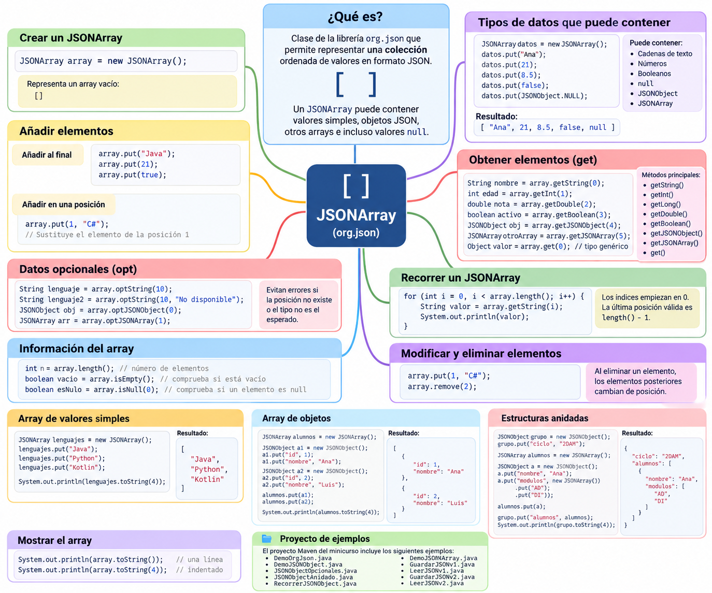

# JSONArray

### 1. Introducción

`JSONArray` es otra de las clases principales de la librería **org.json**.

Mientras que `JSONObject` representa un objeto formado por pares **clave-valor**, `JSONArray` representa una **colección ordenada de valores**.

En JSON, un array se representa mediante corchetes:

```json
[
    "Java",
    "Python",
    "Kotlin"
]
```

Con `org.json`, esta estructura se representa mediante la clase:

```java
JSONArray
```

Por ejemplo:

```java
JSONArray lenguajes = new JSONArray();

lenguajes.put("Java");
lenguajes.put("Python");
lenguajes.put("Kotlin");
```

El resultado será:

```json
[
    "Java",
    "Python",
    "Kotlin"
]
```

!!! info "JSONArray representa un array JSON"
    Cuando en un documento JSON encontramos una estructura delimitada por corchetes `[ ]`, estamos ante un **array JSON**.

    Con la librería `org.json`, este tipo de estructura se representa mediante la clase `JSONArray`.

---

### 2. Mapa general de JSONArray

El siguiente esquema resume las principales operaciones que podemos realizar con `JSONArray` y muestra cómo puede contener tanto valores simples como objetos y otros arrays.



!!! tip "Utiliza el mapa como guía"
    Utiliza este esquema como referencia durante la lección.

    Recuerda especialmente la diferencia fundamental:

    ```text
    JSONObject → accedemos mediante claves
    JSONArray  → accedemos mediante posiciones
    ```

---

### 3. JSONObject frente a JSONArray

Es fundamental distinguir las dos estructuras principales que hemos estudiado.

#### JSONObject

Representa un objeto formado por propiedades:

```json
{
    "nombre": "Ana",
    "edad": 21
}
```

Utiliza:

```text
{ }
```

y cada dato tiene una **clave**:

```text
"nombre" : "Ana"
     ↑         ↑
   clave     valor
```

Para recuperar un dato utilizamos su clave:

```java
String nombre = objeto.getString("nombre");
```

#### JSONArray

Representa una colección ordenada:

```json
[
    "Java",
    "Python",
    "Kotlin"
]
```

Utiliza:

```text
[ ]
```

y sus elementos se identifican mediante una **posición**:

```text
        posición
           ↓

[ "Java", "Python", "Kotlin" ]
     0        1         2
```

Por ejemplo:

```java
String lenguaje = array.getString(0);
```

Podemos resumirlo así:

| Característica | `JSONObject` | `JSONArray` |
|---|---|---|
| Símbolos JSON | `{ }` | `[ ]` |
| Organización | Clave-valor | Posiciones |
| Acceso | Mediante clave | Mediante índice |
| Ejemplo | `"nombre"` | `0`, `1`, `2` |
| Clase Java | `JSONObject` | `JSONArray` |

!!! important "Idea clave"
    En un `JSONObject` buscamos información mediante una **clave**.

    En un `JSONArray` accedemos a los elementos mediante su **posición**.

---

## Creación y operaciones básicas

### 4. Crear un JSONArray

Para utilizar `JSONArray` debemos importar la clase:

```java
import org.json.JSONArray;
```

Después podemos crear un array vacío:

```java
JSONArray modulos = new JSONArray();
```

En ese momento representa:

```json
[]
```

Podemos comprobarlo:

```java
System.out.println(modulos);
```

---

### 5. Añadir elementos con `put()`

El método principal para añadir elementos es:

```java
put(valor)
```

Por ejemplo:

```java
JSONArray modulos = new JSONArray();

modulos.put("Acceso a Datos");
modulos.put("Desarrollo de Interfaces");
modulos.put("Programación de Servicios");
```

El resultado será:

```json
[
    "Acceso a Datos",
    "Desarrollo de Interfaces",
    "Programación de Servicios"
]
```

Cada nuevo elemento se añade al final del array.

Podemos visualizar el proceso:

```text
JSONArray modulos

put("Acceso a Datos")

[0] Acceso a Datos


put("Desarrollo de Interfaces")

[0] Acceso a Datos
[1] Desarrollo de Interfaces


put("Programación de Servicios")

[0] Acceso a Datos
[1] Desarrollo de Interfaces
[2] Programación de Servicios
```

!!! note "No indicamos una clave"
    A diferencia de `JSONObject`, en un `JSONArray` normalmente no escribimos:

    ```java
    put("clave", valor)
    ```

    sino simplemente:

    ```java
    put(valor)
    ```

    La posición del elemento queda determinada por el orden en el que se añade.

---

### 6. Tipos de datos que puede contener

Un `JSONArray` puede contener distintos tipos de valores JSON.

Por ejemplo:

```java
JSONArray datos = new JSONArray();

datos.put("Ana");
datos.put(21);
datos.put(8.35);
datos.put(false);
datos.put(JSONObject.NULL);
```

Representaría:

```json
[
    "Ana",
    21,
    8.35,
    false,
    null
]
```

Por tanto, un array JSON puede contener:

- cadenas de texto;
- números;
- valores booleanos;
- `null`;
- objetos JSON;
- otros arrays JSON.

!!! warning "JSON permite mezclar tipos"
    JSON permite que un mismo array contenga valores de diferentes tipos.

    Sin embargo, en aplicaciones reales suele ser conveniente mantener una estructura coherente.

    Por ejemplo, si un array representa alumnos, normalmente todos sus elementos serán objetos que representen alumnos.

---

### 7. Mostrar un JSONArray

Al igual que con `JSONObject`, podemos utilizar:

```java
toString()
```

Por ejemplo:

```java
System.out.println(modulos.toString());
```

Obtendremos:

```json
["Acceso a Datos","Desarrollo de Interfaces","Programación de Servicios"]
```

También podemos mostrarlo de forma indentada:

```java
System.out.println(modulos.toString(4));
```

Obtendremos:

```json
[
    "Acceso a Datos",
    "Desarrollo de Interfaces",
    "Programación de Servicios"
]
```

El número `4` indica el número de espacios utilizados para la indentación.

!!! tip "Durante el desarrollo"
    `toString(4)` resulta muy útil para comprobar visualmente la estructura del JSON que estamos construyendo.

---

## Acceso a los datos

### 8. Acceder a los elementos de un JSONArray

Los elementos de un array se identifican mediante su posición.

Las posiciones comienzan en:

```text
0
```

Por ejemplo:

```json
[
    "Java",
    "Python",
    "Kotlin"
]
```

tiene las siguientes posiciones:

```text
posición 0 → Java
posición 1 → Python
posición 2 → Kotlin
```

Podemos acceder a ellas mediante:

```java
String primero = lenguajes.getString(0);
String segundo = lenguajes.getString(1);
String tercero = lenguajes.getString(2);
```

!!! important "Los índices comienzan en 0"
    Si un array tiene `3` elementos, sus posiciones son:

    ```text
    0
    1
    2
    ```

    Por tanto, la última posición válida siempre será:

    ```text
    length() - 1
    ```

---

### 9. Métodos `get...()`

Al igual que ocurría con `JSONObject`, existen distintos métodos dependiendo del tipo de dato que queremos recuperar.

Por ejemplo:

```java
JSONArray datos = new JSONArray();

datos.put("Ana");
datos.put(21);
datos.put(8.35);
datos.put(false);
```

Podemos recuperar:

```java
String nombre = datos.getString(0);
int edad = datos.getInt(1);
double nota = datos.getDouble(2);
boolean repetidor = datos.getBoolean(3);
```

Algunos de los métodos disponibles son:

| Método | Devuelve |
|---|---|
| `getString(indice)` | `String` |
| `getInt(indice)` | `int` |
| `getLong(indice)` | `long` |
| `getDouble(indice)` | `double` |
| `getBoolean(indice)` | `boolean` |
| `getJSONObject(indice)` | `JSONObject` |
| `getJSONArray(indice)` | `JSONArray` |
| `get(indice)` | `Object` |

---

### 10. Acceso mediante `get()`

Cuando no conocemos de antemano el tipo del elemento podemos utilizar:

```java
Object valor = datos.get(0);
```

Por ejemplo:

```java
for (int i = 0; i < datos.length(); i++) {

    Object valor = datos.get(i);

    System.out.println(valor);
}
```

Esto resulta especialmente útil cuando trabajamos con arrays cuyos elementos pueden ser de diferentes tipos.

Por ejemplo:

```java
JSONArray datos = new JSONArray();

datos.put("Ana");
datos.put(21);
datos.put(true);

for (int i = 0; i < datos.length(); i++) {

    Object valor = datos.get(i);

    System.out.println(
        valor + " -> "
        + valor.getClass().getSimpleName()
    );
}
```

---

### 11. Número de elementos: `length()`

Para conocer el número de elementos de un array utilizamos:

```java
length()
```

Por ejemplo:

```java
JSONArray modulos = new JSONArray();

modulos.put("Acceso a Datos");
modulos.put("Desarrollo de Interfaces");
modulos.put("Programación de Servicios");

System.out.println(modulos.length());
```

El resultado será:

```text
3
```

Podemos visualizarlo así:

```text
JSONArray
│
├── [0] Acceso a Datos
├── [1] Desarrollo de Interfaces
└── [2] Programación de Servicios

length() → 3
```

---

### 12. Comprobar si un array está vacío

Podemos comprobar si un `JSONArray` no contiene elementos mediante:

```java
isEmpty()
```

Por ejemplo:

```java
JSONArray modulos = new JSONArray();

if (modulos.isEmpty()) {
    System.out.println("No hay módulos");
}
```

Después:

```java
modulos.put("Acceso a Datos");
```

el array ya no estará vacío.

También podríamos realizar la comprobación mediante:

```java
if (modulos.length() == 0) {
    System.out.println("No hay elementos");
}
```

Pero:

```java
isEmpty()
```

expresa de forma más directa nuestra intención.

---

## Recorrido y modificación

### 13. Recorrer un JSONArray

Una de las operaciones más habituales consiste en recorrer todos sus elementos.

Podemos hacerlo mediante un bucle `for`.

```java
for (int i = 0; i < modulos.length(); i++) {

    String modulo = modulos.getString(i);

    System.out.println(modulo);
}
```

Observa la condición:

```java
i < modulos.length()
```

Si tenemos tres elementos:

```text
length() = 3
```

sus posiciones serán:

```text
0
1
2
```

Por eso la última posición válida es:

```text
length() - 1
```

!!! warning "Error frecuente"
    No debemos escribir:

    ```java
    i <= modulos.length()
    ```

    porque intentaríamos acceder a una posición que no existe.

    Utilizaremos:

    ```java
    i < modulos.length()
    ```

---

### 14. Modificar una posición

`JSONArray` también permite utilizar `put()` indicando una posición.

Por ejemplo:

```java
JSONArray lenguajes = new JSONArray();

lenguajes.put("Java");
lenguajes.put("Python");
lenguajes.put("Kotlin");
```

Tenemos:

```json
[
    "Java",
    "Python",
    "Kotlin"
]
```

Podemos sustituir el elemento de la posición `1`:

```java
lenguajes.put(1, "C#");
```

Ahora tendremos:

```json
[
    "Java",
    "C#",
    "Kotlin"
]
```

Por tanto:

```java
put(valor)
```

añade normalmente un elemento al final.

Mientras que:

```java
put(indice, valor)
```

permite establecer un valor en una posición determinada.

---

### 15. Eliminar un elemento

Podemos eliminar un elemento utilizando:

```java
remove(indice)
```

Por ejemplo:

```java
JSONArray lenguajes = new JSONArray();

lenguajes.put("Java");
lenguajes.put("Python");
lenguajes.put("Kotlin");

lenguajes.remove(1);
```

Antes:

```text
[0] Java
[1] Python
[2] Kotlin
```

Después:

```text
[0] Java
[1] Kotlin
```

!!! important "Los índices cambian"
    Cuando eliminamos un elemento, los elementos posteriores cambian de posición.

    En el ejemplo anterior, `Kotlin` estaba inicialmente en la posición `2`, pero después de eliminar `Python` pasa a ocupar la posición `1`.

---

## Datos opcionales y valores null

### 16. Métodos `opt...()`

Al igual que `JSONObject`, `JSONArray` dispone de métodos `opt...()`.

Por ejemplo:

```java
String lenguaje = lenguajes.optString(10);
```

Si la posición no existe, evitamos realizar un acceso estricto mediante `getString()`.

También podemos indicar un valor alternativo:

```java
String lenguaje =
        lenguajes.optString(
            10,
            "No disponible"
        );
```

Existen métodos como:

```text
optString()
optInt()
optLong()
optDouble()
optBoolean()
optJSONObject()
optJSONArray()
```

La idea es similar a la estudiada con `JSONObject`:

```text
get...() → esperamos que exista el dato

opt...() → contemplamos que pueda no existir
```

Por ejemplo:

```java
JSONArray datos = new JSONArray();

datos.put("Java");
datos.put(21);

String lenguaje =
        datos.optString(
            0,
            "Desconocido"
        );

String otroLenguaje =
        datos.optString(
            10,
            "No disponible"
        );

System.out.println(lenguaje);
System.out.println(otroLenguaje);
```

---

### 17. Valores `null` en un JSONArray

Podemos almacenar explícitamente un valor nulo JSON mediante:

```java
JSONObject.NULL
```

Por ejemplo:

```java
JSONArray datos = new JSONArray();

datos.put("Ana");
datos.put(JSONObject.NULL);
datos.put(8.5);
```

El resultado será:

```json
[
    "Ana",
    null,
    8.5
]
```

Podemos comprobar si una posición contiene `null` mediante:

```java
if (datos.isNull(1)) {
    System.out.println("El valor es null");
}
```

!!! note "null en JSON"
    `JSONObject.NULL` representa explícitamente el valor:

    ```json
    null
    ```

    dentro de la estructura JSON.

---

## Arrays de objetos

### 18. JSONArray de JSONObject

Hasta ahora hemos utilizado principalmente arrays de valores simples.

Sin embargo, una de las estructuras más habituales en JSON es un **array de objetos**.

Supongamos que queremos representar varios alumnos:

```json
[
    {
        "id": 1,
        "nombre": "Ana",
        "nota": 8.5
    },
    {
        "id": 2,
        "nombre": "Luis",
        "nota": 7.2
    },
    {
        "id": 3,
        "nombre": "Marta",
        "nota": 9.1
    }
]
```

La estructura principal es:

```text
JSONArray
│
├── [0] JSONObject
│       ├── id
│       ├── nombre
│       └── nota
│
├── [1] JSONObject
│       ├── id
│       ├── nombre
│       └── nota
│
└── [2] JSONObject
        ├── id
        ├── nombre
        └── nota
```

Este tipo de estructura será muy habitual cuando trabajemos con colecciones de información.

---

### 19. Construir un array de objetos

Primero creamos los objetos:

```java
JSONObject alumno1 = new JSONObject();

alumno1.put("id", 1);
alumno1.put("nombre", "Ana");
alumno1.put("nota", 8.5);
```

Creamos otro:

```java
JSONObject alumno2 = new JSONObject();

alumno2.put("id", 2);
alumno2.put("nombre", "Luis");
alumno2.put("nota", 7.2);
```

Y otro:

```java
JSONObject alumno3 = new JSONObject();

alumno3.put("id", 3);
alumno3.put("nombre", "Marta");
alumno3.put("nota", 9.1);
```

Después creamos el array:

```java
JSONArray alumnos = new JSONArray();
```

y añadimos los objetos:

```java
alumnos.put(alumno1);
alumnos.put(alumno2);
alumnos.put(alumno3);
```

Finalmente:

```java
System.out.println(alumnos.toString(4));
```

mostrará:

```json
[
    {
        "id": 1,
        "nombre": "Ana",
        "nota": 8.5
    },
    {
        "id": 2,
        "nombre": "Luis",
        "nota": 7.2
    },
    {
        "id": 3,
        "nombre": "Marta",
        "nota": 9.1
    }
]
```

---

### 20. Recuperar un JSONObject del array

Si sabemos que los elementos del array son objetos, podemos utilizar:

```java
getJSONObject(indice)
```

Por ejemplo:

```java
JSONObject primerAlumno =
        alumnos.getJSONObject(0);
```

Después podemos acceder a sus propiedades:

```java
String nombre =
        primerAlumno.getString("nombre");

double nota =
        primerAlumno.getDouble("nota");
```

También podemos encadenar las operaciones:

```java
String nombre =
        alumnos.getJSONObject(0)
               .getString("nombre");
```

En este caso:

```text
alumnos
   │
   │ getJSONObject(0)
   ▼
JSONObject
   │
   │ getString("nombre")
   ▼
 "Ana"
```

---

### 21. Recorrer un array de objetos

Una operación muy habitual consiste en recorrer una colección de objetos.

```java
for (int i = 0; i < alumnos.length(); i++) {

    JSONObject alumno =
            alumnos.getJSONObject(i);

    int id =
            alumno.getInt("id");

    String nombre =
            alumno.getString("nombre");

    double nota =
            alumno.getDouble("nota");

    System.out.println(
        id + " - "
        + nombre
        + " - "
        + nota
    );
}
```

El proceso puede visualizarse así:

```text
JSONArray alumnos
       │
       ▼
   posición i
       │
       ▼
getJSONObject(i)
       │
       ▼
JSONObject alumno
       │
       ├── getInt("id")
       ├── getString("nombre")
       └── getDouble("nota")
```

---

## Combinación de JSONObject y JSONArray

### 22. JSONArray dentro de JSONObject

Ya vimos un ejemplo de este caso al estudiar `JSONObject`.

Supongamos:

```json
{
    "id": 1024,
    "nombre": "Ana",
    "modulos": [
        "Acceso a Datos",
        "Desarrollo de Interfaces",
        "Programación de Servicios"
    ]
}
```

La estructura es:

```text
JSONObject alumno
│
├── id
├── nombre
│
└── modulos
        │
        └── JSONArray
              ├── [0]
              ├── [1]
              └── [2]
```

En Java:

```java
JSONObject alumno = new JSONObject();

alumno.put("id", 1024);
alumno.put("nombre", "Ana");

JSONArray modulos = new JSONArray();

modulos.put("Acceso a Datos");
modulos.put("Desarrollo de Interfaces");
modulos.put("Programación de Servicios");

alumno.put("modulos", modulos);
```

---

### 23. Recuperar el JSONArray contenido en un JSONObject

Podemos recuperar el array mediante:

```java
JSONArray modulos =
        alumno.getJSONArray("modulos");
```

Y recorrerlo:

```java
for (int i = 0; i < modulos.length(); i++) {

    System.out.println(
        modulos.getString(i)
    );
}
```

Observa la secuencia:

```text
JSONObject
    │
    │ getJSONArray("modulos")
    ▼
JSONArray
    │
    │ getString(i)
    ▼
 elemento
```

---

### 24. Arrays dentro de arrays

Un `JSONArray` también puede contener otros arrays.

Por ejemplo:

```json
[
    ["Java", "Kotlin"],
    ["Python", "JavaScript"],
    ["HTML", "CSS"]
]
```

Podemos construirlo así:

```java
JSONArray backend = new JSONArray();

backend.put("Java");
backend.put("Kotlin");


JSONArray scripting = new JSONArray();

scripting.put("Python");
scripting.put("JavaScript");


JSONArray frontend = new JSONArray();

frontend.put("HTML");
frontend.put("CSS");


JSONArray tecnologias = new JSONArray();

tecnologias.put(backend);
tecnologias.put(scripting);
tecnologias.put(frontend);
```

La estructura será:

```text
JSONArray tecnologias
│
├── [0] JSONArray
│       ├── Java
│       └── Kotlin
│
├── [1] JSONArray
│       ├── Python
│       └── JavaScript
│
└── [2] JSONArray
        ├── HTML
        └── CSS
```

Para recuperar el primer array:

```java
JSONArray primerGrupo =
        tecnologias.getJSONArray(0);
```

Y su primer elemento:

```java
String lenguaje =
        primerGrupo.getString(0);
```

También podríamos acceder directamente:

```java
String lenguaje =
        tecnologias
            .getJSONArray(0)
            .getString(0);
```

---

## Estructuras JSON más completas

### 25. Ejemplo: grupo de alumnos

Vamos a construir una estructura algo más próxima a un caso real.

Queremos representar:

```json
{
    "ciclo": "DAM",
    "curso": 2,
    "alumnos": [
        {
            "id": 1,
            "nombre": "Ana",
            "modulos": [
                "Acceso a Datos",
                "Desarrollo de Interfaces"
            ]
        },
        {
            "id": 2,
            "nombre": "Luis",
            "modulos": [
                "Acceso a Datos",
                "Programación de Servicios"
            ]
        }
    ]
}
```

Observa que tenemos varios niveles:

```text
JSONObject grupo
│
├── ciclo
├── curso
│
└── alumnos ───────────── JSONArray
       │
       ├── [0] ────────── JSONObject
       │      ├── id
       │      ├── nombre
       │      │
       │      └── modulos ── JSONArray
       │
       └── [1] ────────── JSONObject
              ├── id
              ├── nombre
              │
              └── modulos ── JSONArray
```

---

### 26. Construcción paso a paso

#### Paso 1. Crear los módulos de Ana

```java
JSONArray modulosAna = new JSONArray();

modulosAna.put("Acceso a Datos");
modulosAna.put("Desarrollo de Interfaces");
```

#### Paso 2. Crear a Ana

```java
JSONObject ana = new JSONObject();

ana.put("id", 1);
ana.put("nombre", "Ana");
ana.put("modulos", modulosAna);
```

En este momento tenemos:

```json
{
    "id": 1,
    "nombre": "Ana",
    "modulos": [
        "Acceso a Datos",
        "Desarrollo de Interfaces"
    ]
}
```

#### Paso 3. Crear los módulos de Luis

```java
JSONArray modulosLuis = new JSONArray();

modulosLuis.put("Acceso a Datos");
modulosLuis.put("Programación de Servicios");
```

#### Paso 4. Crear a Luis

```java
JSONObject luis = new JSONObject();

luis.put("id", 2);
luis.put("nombre", "Luis");
luis.put("modulos", modulosLuis);
```

#### Paso 5. Crear el array de alumnos

```java
JSONArray alumnos = new JSONArray();

alumnos.put(ana);
alumnos.put(luis);
```

Ahora tenemos:

```json
[
    {
        "id": 1,
        "nombre": "Ana",
        "modulos": [
            "Acceso a Datos",
            "Desarrollo de Interfaces"
        ]
    },
    {
        "id": 2,
        "nombre": "Luis",
        "modulos": [
            "Acceso a Datos",
            "Programación de Servicios"
        ]
    }
]
```

#### Paso 6. Crear el objeto principal

```java
JSONObject grupo = new JSONObject();

grupo.put("ciclo", "DAM");
grupo.put("curso", 2);
grupo.put("alumnos", alumnos);
```

Finalmente:

```java
System.out.println(grupo.toString(4));
```

---

### 27. Recorrer una estructura anidada

Supongamos que queremos mostrar todos los alumnos y sus módulos.

Primero obtenemos el array de alumnos:

```java
JSONArray alumnos =
        grupo.getJSONArray("alumnos");
```

Después recorremos los alumnos:

```java
for (int i = 0; i < alumnos.length(); i++) {

    JSONObject alumno =
            alumnos.getJSONObject(i);

    System.out.println(
        "Alumno: "
        + alumno.getString("nombre")
    );

    JSONArray modulos =
            alumno.getJSONArray("modulos");

    for (int j = 0; j < modulos.length(); j++) {

        System.out.println(
            "  - "
            + modulos.getString(j)
        );
    }
}
```

La salida será similar a:

```text
Alumno: Ana
  - Acceso a Datos
  - Desarrollo de Interfaces

Alumno: Luis
  - Acceso a Datos
  - Programación de Servicios
```

Este ejemplo muestra una idea muy importante:

```text
JSONObject
    ↓
JSONArray alumnos
    ↓
JSONObject alumno
    ↓
JSONArray modulos
    ↓
String
```

!!! important "Leer JSON consiste en recorrer su estructura"
    Cuando trabajamos con documentos JSON complejos debemos identificar qué tipo de estructura tenemos en cada nivel:

    - si encontramos `{ }` → `JSONObject`;
    - si encontramos `[ ]` → `JSONArray`;
    - si encontramos un valor simple → utilizaremos el método `get...()` adecuado.

---

## Ejemplos del proyecto Maven

### 28. DemoJSONArray.java

En el proyecto Maven del minicurso utilizaremos:

```text
DemoJSONArray.java
```

Este ejemplo reúne las operaciones fundamentales de `JSONArray`.

```java
package com.example;

import org.json.JSONArray;
import org.json.JSONObject;

public class DemoJSONArray {

    public static void main(String[] args) {

        // ==========================================
        // 1. ARRAY DE VALORES SIMPLES
        // ==========================================

        JSONArray modulos = new JSONArray();

        modulos.put("Acceso a Datos");
        modulos.put("Desarrollo de Interfaces");
        modulos.put("Programación de Servicios");

        System.out.println("ARRAY DE MÓDULOS");
        System.out.println(modulos.toString(4));


        // ==========================================
        // 2. ACCEDER A LOS ELEMENTOS
        // ==========================================

        System.out.println("\nPrimer módulo:");

        System.out.println(
            modulos.getString(0)
        );


        // ==========================================
        // 3. RECORRER EL ARRAY
        // ==========================================

        System.out.println("\nLISTADO DE MÓDULOS");

        for (int i = 0; i < modulos.length(); i++) {

            System.out.println(
                i + " -> "
                + modulos.getString(i)
            );
        }


        // ==========================================
        // 4. CREAR OBJETOS
        // ==========================================

        JSONObject alumno1 = new JSONObject();

        alumno1.put("id", 1);
        alumno1.put("nombre", "Ana");
        alumno1.put("nota", 8.5);


        JSONObject alumno2 = new JSONObject();

        alumno2.put("id", 2);
        alumno2.put("nombre", "Luis");
        alumno2.put("nota", 7.2);


        JSONObject alumno3 = new JSONObject();

        alumno3.put("id", 3);
        alumno3.put("nombre", "Marta");
        alumno3.put("nota", 9.1);


        // ==========================================
        // 5. ARRAY DE OBJETOS
        // ==========================================

        JSONArray alumnos = new JSONArray();

        alumnos.put(alumno1);
        alumnos.put(alumno2);
        alumnos.put(alumno3);

        System.out.println("\nARRAY DE ALUMNOS");

        System.out.println(
            alumnos.toString(4)
        );


        // ==========================================
        // 6. RECORRER ARRAY DE OBJETOS
        // ==========================================

        System.out.println("\nALUMNOS");

        for (int i = 0; i < alumnos.length(); i++) {

            JSONObject alumno =
                    alumnos.getJSONObject(i);

            System.out.println(
                alumno.getInt("id")
                + " - "
                + alumno.getString("nombre")
                + " - Nota: "
                + alumno.getDouble("nota")
            );
        }


        // ==========================================
        // 7. DATOS OPCIONALES
        // ==========================================

        JSONObject alumno =
                alumnos.getJSONObject(0);

        String email =
                alumno.optString(
                    "email",
                    "No disponible"
                );

        System.out.println(
            "\nEmail de "
            + alumno.getString("nombre")
            + ": "
            + email
        );


        // ==========================================
        // 8. INFORMACIÓN DEL ARRAY
        // ==========================================

        System.out.println(
            "\nNúmero de alumnos: "
            + alumnos.length()
        );

        System.out.println(
            "¿Está vacío?: "
            + alumnos.isEmpty()
        );
    }
}
```

---

### 29. JSONArrayAnidado.java

Para practicar estructuras más completas utilizaremos también:

```text
JSONArrayAnidado.java
```

En este ejemplo combinamos:

```text
JSONObject
    ↓
JSONArray
    ↓
JSONObject
    ↓
JSONArray
```

Código:

```java
package com.example;

import org.json.JSONArray;
import org.json.JSONObject;

public class JSONArrayAnidado {

    public static void main(String[] args) {

        // ==========================================
        // 1. MÓDULOS DE ANA
        // ==========================================

        JSONArray modulosAna = new JSONArray();

        modulosAna.put("Acceso a Datos");
        modulosAna.put("Desarrollo de Interfaces");


        // ==========================================
        // 2. ALUMNA ANA
        // ==========================================

        JSONObject ana = new JSONObject();

        ana.put("id", 1);
        ana.put("nombre", "Ana");
        ana.put("modulos", modulosAna);


        // ==========================================
        // 3. MÓDULOS DE LUIS
        // ==========================================

        JSONArray modulosLuis = new JSONArray();

        modulosLuis.put("Acceso a Datos");
        modulosLuis.put("Programación de Servicios");


        // ==========================================
        // 4. ALUMNO LUIS
        // ==========================================

        JSONObject luis = new JSONObject();

        luis.put("id", 2);
        luis.put("nombre", "Luis");
        luis.put("modulos", modulosLuis);


        // ==========================================
        // 5. ARRAY DE ALUMNOS
        // ==========================================

        JSONArray alumnos = new JSONArray();

        alumnos.put(ana);
        alumnos.put(luis);


        // ==========================================
        // 6. OBJETO PRINCIPAL
        // ==========================================

        JSONObject grupo = new JSONObject();

        grupo.put("ciclo", "DAM");
        grupo.put("curso", 2);
        grupo.put("alumnos", alumnos);


        // ==========================================
        // 7. MOSTRAR JSON COMPLETO
        // ==========================================

        System.out.println("JSON COMPLETO");

        System.out.println(
            grupo.toString(4)
        );


        // ==========================================
        // 8. RECORRER LA ESTRUCTURA
        // ==========================================

        JSONArray listaAlumnos =
                grupo.getJSONArray("alumnos");

        System.out.println("\nALUMNOS Y MÓDULOS");

        for (int i = 0;
             i < listaAlumnos.length();
             i++) {

            JSONObject alumno =
                    listaAlumnos.getJSONObject(i);

            System.out.println(
                "\nAlumno: "
                + alumno.getString("nombre")
            );

            JSONArray modulos =
                    alumno.getJSONArray("modulos");

            for (int j = 0;
                 j < modulos.length();
                 j++) {

                System.out.println(
                    "  - "
                    + modulos.getString(j)
                );
            }
        }
    }
}
```

!!! tip "Dos ejemplos con objetivos diferentes"
    `DemoJSONArray.java` está pensado para aprender las **operaciones fundamentales** de la clase.

    `JSONArrayAnidado.java` permite practicar la construcción y recorrido de **estructuras JSON con varios niveles**.

---

## Métodos principales

### 30. Resumen de métodos de JSONArray

| Necesitamos... | Método |
|---|---|
| Crear un array | `new JSONArray()` |
| Añadir al final | `put(valor)` |
| Establecer un valor en una posición | `put(indice, valor)` |
| Obtener un elemento genérico | `get(indice)` |
| Obtener un texto | `getString(indice)` |
| Obtener un entero | `getInt(indice)` |
| Obtener un `long` | `getLong(indice)` |
| Obtener un decimal | `getDouble(indice)` |
| Obtener un booleano | `getBoolean(indice)` |
| Obtener un objeto | `getJSONObject(indice)` |
| Obtener otro array | `getJSONArray(indice)` |
| Obtener un dato opcional | `opt...()` |
| Comprobar `null` | `isNull(indice)` |
| Eliminar un elemento | `remove(indice)` |
| Número de elementos | `length()` |
| Comprobar si está vacío | `isEmpty()` |
| Convertir a texto | `toString()` |
| Mostrar indentado | `toString(4)` |

---

## Errores frecuentes

### 31. Confundir JSONObject y JSONArray

Si tenemos:

```json
{
    "nombre": "Ana"
}
```

utilizamos:

```java
JSONObject
```

Si tenemos:

```json
[
    "Ana",
    "Luis",
    "Marta"
]
```

utilizamos:

```java
JSONArray
```

Recuerda:

```text
{ } → JSONObject

[ ] → JSONArray
```

---

### 32. Intentar acceder mediante una clave

Un `JSONArray` no utiliza claves como:

```java
array.getString("nombre");
```

Accedemos mediante posiciones:

```java
array.getString(0);
```

Las claves pertenecen a los objetos `JSONObject`.

---

### 33. Olvidar que los índices empiezan en cero

Para:

```json
[
    "Java",
    "Python",
    "Kotlin"
]
```

las posiciones son:

```text
Java   → 0
Python → 1
Kotlin → 2
```

No existe la posición `3`.

---

### 34. Recorrer incorrectamente el array

Incorrecto:

```java
for (int i = 0; i <= array.length(); i++) {
```

Correcto:

```java
for (int i = 0; i < array.length(); i++) {
```

La razón es:

```text
length() = número de elementos

última posición = length() - 1
```

---

### 35. Utilizar el método de acceso incorrecto

Si tenemos:

```json
[
    {
        "nombre": "Ana"
    }
]
```

el elemento `0` no es un `String`.

Es un objeto JSON.

Por tanto, no utilizaríamos:

```java
alumnos.getString(0);
```

sino:

```java
JSONObject alumno =
        alumnos.getJSONObject(0);
```

y después:

```java
String nombre =
        alumno.getString("nombre");
```

---

### 36. Confundir el nivel de la estructura

Supongamos:

```json
{
    "alumnos": [
        {
            "nombre": "Ana"
        }
    ]
}
```

No podemos acceder directamente mediante:

```java
json.getString("nombre");
```

porque `nombre` no está en el objeto raíz.

Debemos recorrer los niveles:

```java
JSONArray alumnos =
        json.getJSONArray("alumnos");

JSONObject alumno =
        alumnos.getJSONObject(0);

String nombre =
        alumno.getString("nombre");
```

Es decir:

```text
JSONObject raíz
      │
      │ getJSONArray("alumnos")
      ▼
JSONArray
      │
      │ getJSONObject(0)
      ▼
JSONObject alumno
      │
      │ getString("nombre")
      ▼
    "Ana"
```

!!! tip "Lee la estructura antes de programar"
    Antes de escribir el código Java, observa el documento JSON e identifica:

    ```text
    { } → JSONObject
    [ ] → JSONArray
    ```

    Después recorre la estructura nivel a nivel.

---

## Resumen

### 37. Esquema general de JSONArray

```text
JSONArray
│
├── Crear
│      └── new JSONArray()
│
├── Añadir
│      ├── put(valor)
│      └── put(indice, valor)
│
├── Consultar
│      ├── get()
│      ├── getString()
│      ├── getInt()
│      ├── getDouble()
│      ├── getBoolean()
│      ├── getJSONObject()
│      └── getJSONArray()
│
├── Datos opcionales
│      └── opt...()
│
├── Comprobar
│      ├── isNull()
│      ├── length()
│      └── isEmpty()
│
├── Eliminar
│      └── remove()
│
├── Recorrer
│      └── for
│
├── Puede contener
│      ├── valores simples
│      ├── JSONObject
│      └── JSONArray
│
└── Mostrar
       ├── toString()
       └── toString(4)
```

---

### 38. JSONObject + JSONArray

Las dos clases se complementan:

```text
                   JSON
                    │
          ┌─────────┴─────────┐
          │                   │
          ▼                   ▼
     JSONObject           JSONArray
          │                   │
       { ... }              [ ... ]
          │                   │
     clave-valor          posiciones
          │                   │
          └─────────┬─────────┘
                    │
                    ▼
           pueden contenerse
             entre sí
```

Por ejemplo:

```json
{
    "grupo": "2DAM",
    "alumnos": [
        {
            "id": 1,
            "nombre": "Ana"
        },
        {
            "id": 2,
            "nombre": "Luis"
        }
    ]
}
```

se interpreta como:

```text
JSONObject
│
├── grupo → String
│
└── alumnos → JSONArray
                 │
                 ├── JSONObject
                 │      ├── id
                 │      └── nombre
                 │
                 └── JSONObject
                        ├── id
                        └── nombre
```

!!! important "Idea clave"
    Para trabajar correctamente con un documento JSON debemos ser capaces de reconocer su estructura.

    Cada vez que encontremos:

    ```text
    { } → JSONObject
    [ ] → JSONArray
    ```

    A partir de ahí podremos decidir qué método necesitamos para avanzar por cada nivel del documento.

---

### 39. ¿Qué debemos saber antes de continuar?

Antes de avanzar a la lectura y escritura de ficheros JSON deberíamos ser capaces de:

- crear un `JSONArray`;
- añadir elementos mediante `put()`;
- recuperar valores mediante `get...()`;
- utilizar `length()` e `isEmpty()`;
- recorrer un array;
- trabajar con datos opcionales mediante `opt...()`;
- distinguir `JSONObject` y `JSONArray`;
- crear arrays de objetos;
- introducir un `JSONArray` dentro de un `JSONObject`;
- introducir objetos dentro de un `JSONArray`;
- trabajar con estructuras JSON anidadas;
- recorrer una estructura combinando `JSONObject` y `JSONArray`.

Una vez dominadas estas operaciones estaremos preparados para el siguiente paso:

```text
JSONObject + JSONArray
          ↓
 convertir a texto JSON
          ↓
 guardar en un fichero
          ↓
 recuperar el contenido
          ↓
 JSONTokener
          ↓
 reconstruir JSONObject / JSONArray
```

### 40. Ejemplos incluidos en el proyecto

Los ejemplos correspondientes a `JSONArray` están incluidos en el proyecto Maven descargable de `org.json`:

| Ejemplo | Contenido que practica |
|---|---|
| `DemoJSONArray.java` | Creación de un `JSONArray`, `put()`, acceso por posición, métodos `get...()`, `length()`, `isEmpty()`, modificación, eliminación y recorrido |
| `JSONArrayAnidado.java` | Estructuras JSON más complejas combinando `JSONObject` y `JSONArray` en varios niveles |

!!! tip "Proyecto de ejemplos"
    Estos ejemplos forman parte del **proyecto Maven común de `org.json`**.

    No es necesario descargar un proyecto diferente para cada apartado. El proyecto completo está disponible desde la página de **Introducción a org.json** y contiene todos los ejemplos que iremos utilizando durante el tema.