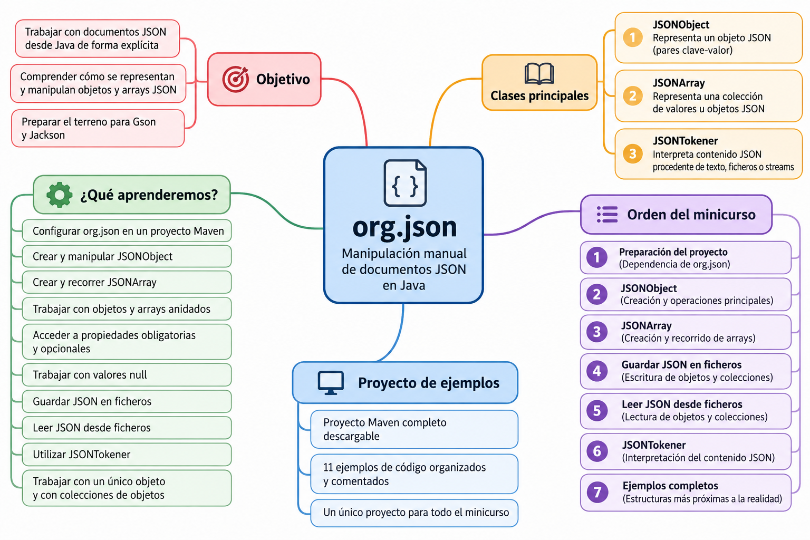

# org.json

### Introducción

`org.json` es una librería que permite trabajar con documentos JSON desde Java de forma **explícita y manual**.

A diferencia de otras librerías como **Gson** o **Jackson**, con `org.json` construiremos y recorreremos nosotros mismos la estructura del documento JSON utilizando principalmente tres clases:

- `JSONObject`
- `JSONArray`
- `JSONTokener`

Esto nos permitirá comprender cómo se representan y manipulan los **objetos y arrays JSON** antes de utilizar mecanismos de conversión automática entre objetos Java y JSON.

!!! info "¿Por qué empezamos por org.json?"
    Con `org.json` trabajaremos directamente con la estructura del documento JSON.

    Tendremos que crear los objetos y arrays, añadir sus datos, acceder a sus propiedades y recorrer sus elementos.

    Esta forma de trabajar nos ayudará a comprender mejor JSON antes de estudiar **Gson** y **Jackson**, donde veremos mecanismos más automáticos de conversión entre objetos Java y JSON.

---

### Mapa del minicurso

El siguiente mapa resume los principales conceptos que estudiaremos con `org.json`, las clases fundamentales y el recorrido que seguiremos durante el minicurso.



---

### ¿Qué aprenderemos?

En este minicurso aprenderemos a:

- configurar la librería `org.json` en un proyecto Maven;
- localizar e incorporar su dependencia;
- crear y manipular objetos JSON mediante `JSONObject`;
- crear y recorrer arrays JSON mediante `JSONArray`;
- trabajar con objetos y arrays anidados;
- acceder a propiedades obligatorias y opcionales;
- trabajar con valores `null`;
- recorrer estructuras JSON;
- convertir objetos y arrays JSON a texto;
- guardar documentos JSON en ficheros;
- leer documentos JSON desde ficheros;
- utilizar `JSONTokener` durante la lectura;
- trabajar con documentos formados por un único objeto y con colecciones de objetos.

---

### Proyecto Maven de ejemplos

Durante todo el minicurso utilizaremos un **proyecto Maven completo** con los ejemplos de código de la librería `org.json`.

[📦 **Descargar proyecto Maven completo de org.json**](../../../../descargas/ut1/java-json/org-json-ejemplos.zip)

El proyecto está preparado para trabajar con **Java 21** y contiene todos los ejemplos que iremos utilizando a lo largo de los distintos apartados.

#### Orden recomendado de los ejemplos

| Orden | Ejemplo | Contenido principal |
|---:|---|---|
| 1 | `DemoOrgJson.java` | Primera toma de contacto con `org.json` y creación de un `JSONObject` sencillo. |
| 2 | `DemoJSONObject.java` | Tipos de datos, `put()`, recuperación y modificación de valores y `toString(4)`. |
| 3 | `JSONObjectOpcionales.java` | Uso de `opt...()`, `has()`, `isNull()` y `JSONObject.NULL`. |
| 4 | `JSONObjectAnidado.java` | Creación y acceso a objetos `JSONObject` anidados. |
| 5 | `RecorrerJSONObject.java` | Recorrido de las propiedades mediante `keySet()` y recuperación mediante `get()`. |
| 6 | `DemoJSONArray.java` | Creación, acceso, modificación, eliminación y recorrido de un `JSONArray`. |
| 7 | `JSONArrayAnidado.java` | Combinación de `JSONObject` y `JSONArray` en estructuras JSON de varios niveles. |
| 8 | `GuardarJSONv1.java` | Escritura de un `JSONObject` en `data/persona.json`. |
| 9 | `LeerJSONv1.java` | Lectura de `persona.json` mediante `FileReader`, `JSONTokener` y `JSONObject`. |
| 10 | `GuardarJSONv2.java` | Escritura de un `JSONArray` de objetos en `data/personas.json`. |
| 11 | `LeerJSONv2.java` | Lectura con `BufferedReader`, `JSONTokener`, `nextValue()` y tratamiento de `JSONObject`/`JSONArray`. |

!!! tip "Cómo utilizar el proyecto"
    Descarga y descomprime el fichero ZIP.

    Abre la carpeta como **proyecto Maven** en tu entorno de desarrollo y comprueba que estás trabajando con **JDK 21**.

    Ejecuta los ejemplos siguiendo el orden indicado en la tabla.

    El fichero `README.md` incluido en el proyecto contiene también el orden recomendado y una descripción de cada ejemplo.

!!! note "Un único proyecto para todo el minicurso"
    No es necesario crear un proyecto diferente para cada ejemplo.

    Todos los programas de esta sección utilizan la misma dependencia de `org.json` y están incluidos en el mismo proyecto Maven.

    En cada apartado indicaremos qué clases del proyecto corresponden a los conceptos estudiados.

---

### Contenidos del minicurso

Seguiremos el siguiente recorrido:

```text
Preparación del proyecto
          │
          ▼
      JSONObject
          │
          ▼
      JSONArray
          │
          ▼
   Guardar JSON
          │
          ▼
    Leer JSON
          │
          ▼
    JSONTokener
          │
          ▼
 Estructuras completas
```

#### 1. Preparación del proyecto

Configuraremos el proyecto Maven y añadiremos la dependencia de `org.json`.

También veremos de dónde obtiene Maven las librerías y cómo localizar una dependencia.

---

#### 2. JSONObject

Aprenderemos a representar objetos JSON mediante `JSONObject`.

Veremos, entre otras operaciones:

- `put()`
- `getString()`
- `getInt()`
- `getDouble()`
- `getBoolean()`
- `opt...()`
- `has()`
- `isNull()`
- `remove()`
- `keySet()`
- `toString()`

También trabajaremos con objetos anidados y estructuras más completas.

Los ejemplos principales del proyecto para este apartado son:

```text
DemoOrgJson.java
DemoJSONObject.java
JSONObjectOpcionales.java
JSONObjectAnidado.java
RecorrerJSONObject.java
```

---

#### 3. JSONArray

Utilizaremos `JSONArray` para representar colecciones de valores y objetos.

Aprenderemos a:

- crear arrays;
- añadir elementos mediante `put()`;
- acceder a sus posiciones;
- recuperar valores;
- modificar elementos;
- eliminar elementos;
- recorrer arrays;
- almacenar objetos `JSONObject` dentro de un array;
- combinar arrays y objetos en varios niveles.

Los ejemplos principales son:

```text
DemoJSONArray.java
JSONArrayAnidado.java
```

---

#### 4. Guardar JSON en ficheros

Construiremos documentos JSON en memoria y posteriormente los almacenaremos en ficheros.

Trabajaremos tanto con:

- un único `JSONObject`;
- un `JSONArray` que contiene varios objetos.

El proceso general será:

```text
JSONObject / JSONArray
          │
          │ toString(4)
          ▼
        String
          │
          │ FileWriter
          ▼
      fichero .json
```

Los ejemplos correspondientes son:

```text
GuardarJSONv1.java
GuardarJSONv2.java
```

---

#### 5. Leer JSON desde ficheros

Realizaremos el proceso inverso: recuperaremos documentos JSON almacenados en ficheros y accederemos a la información que contienen.

El proceso general será:

```text
fichero .json
      │
      ▼
FileReader / BufferedReader
      │
      ▼
  JSONTokener
      │
      ▼
JSONObject / JSONArray
      │
      ▼
 get...() / opt...()
      │
      ▼
   datos Java
```

Los ejemplos correspondientes son:

```text
LeerJSONv1.java
LeerJSONv2.java
```

---

#### 6. JSONTokener

Durante la lectura utilizaremos `JSONTokener` para interpretar el contenido JSON procedente de un fichero o stream.

Podremos utilizarlo directamente para construir una estructura conocida:

```java
JSONTokener tokener = new JSONTokener(reader);

JSONObject objeto = new JSONObject(tokener);
```

o utilizar:

```java
Object contenido = tokener.nextValue();
```

para comprobar posteriormente qué estructura hemos obtenido:

```java
if (contenido instanceof JSONObject objeto) {

    // Procesar JSONObject

} else if (contenido instanceof JSONArray array) {

    // Procesar JSONArray
}
```

!!! important "JSONTokener y la lectura"
    `JSONTokener` aparecerá fundamentalmente cuando **leamos** documentos JSON.

    Para construir un documento JSON en memoria utilizaremos principalmente `JSONObject` y `JSONArray`.

---

#### 7. Estructuras completas

Finalmente combinaremos los conceptos anteriores para trabajar con estructuras JSON más próximas a las que podemos encontrar en aplicaciones reales.

Por ejemplo:

```json
{
    "grupo": "2DAM",
    "alumnos": [
        {
            "id": 1,
            "nombre": "Ana",
            "modulos": [
                "Acceso a Datos",
                "Desarrollo de Interfaces"
            ]
        },
        {
            "id": 2,
            "nombre": "Luis",
            "modulos": [
                "Acceso a Datos",
                "Programación de Servicios"
            ]
        }
    ]
}
```

En este tipo de documento aparecen combinados:

```text
JSONObject
    │
    └── JSONArray
            │
            ├── JSONObject
            │       │
            │       └── JSONArray
            │
            └── JSONObject
                    │
                    └── JSONArray
```

---

### Clases principales

| Clase | Utilidad |
|---|---|
| `JSONObject` | Representa un objeto JSON formado por pares clave-valor. |
| `JSONArray` | Representa una colección de valores u objetos JSON. |
| `JSONTokener` | Interpreta contenido JSON procedente de texto, ficheros o streams. |

Podemos resumir la relación entre ellas de esta forma:

```text
                    org.json
                       │
          ┌────────────┼────────────┐
          │            │            │
          ▼            ▼            ▼
     JSONObject     JSONArray   JSONTokener
          │            │            │
          │            │            │
       objetos      colecciones    lectura
          │            │          de JSON
          └──────┬─────┘
                 │
                 ▼
         Documento JSON
```

---

### Flujo completo de trabajo

Al terminar este minicurso debemos ser capaces de comprender todo el ciclo:

```text
                  CREACIÓN
                     │
                     ▼
              JSONObject
              JSONArray
                     │
                     │ put()
                     ▼
              ESTRUCTURA JSON
                     │
                     │ toString(4)
                     ▼
                 FileWriter
                     │
                     ▼
              ┌─────────────┐
              │ FICHERO JSON│
              └─────────────┘
                     │
                     ▼
          FileReader / BufferedReader
                     │
                     ▼
                JSONTokener
                     │
                     ▼
           JSONObject / JSONArray
                     │
                     │ get...() / opt...()
                     ▼
                 DATOS JAVA
```

!!! success "Objetivo del minicurso"
    Al finalizar `org.json` deberemos ser capaces de **crear, modificar, recorrer, guardar y leer estructuras JSON desde Java**.

    Además, comprenderemos la estructura del documento JSON antes de pasar a librerías como **Gson** y **Jackson**, que automatizan parte de este trabajo.