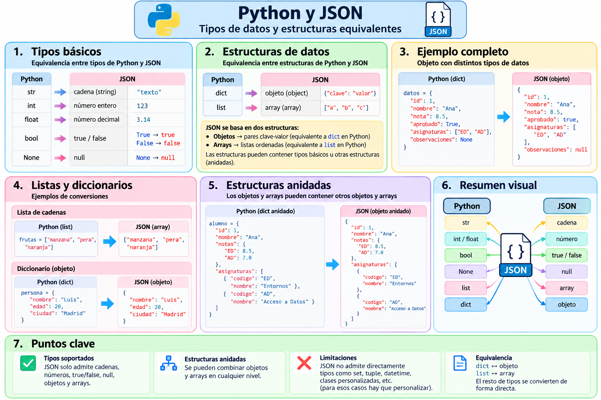

# Diccionarios, listas y estructuras JSON

## 1. Correspondencia natural

Python y JSON tienen estructuras muy parecidas.

```text
Python dict  ⇄ JSON object
Python list  ⇄ JSON array
```
El siguiente esquema resume las correspondencias entre los principales tipos de datos y estructuras de Python y JSON:



---

## 2. Diccionario simple

```python
alumno = {
    "nombre": "Ana",
    "edad": 20,
    "aprobado": True
}
```

JSON:

```json
{
  "nombre": "Ana",
  "edad": 20,
  "aprobado": true
}
```

Observa:

```text
True  → true
False → false
None  → null
```

---

## 3. Listas

```python
notas = [8.5, 7.2, 9.1]
```

se convierte en:

```json
[
  8.5,
  7.2,
  9.1
]
```

---

## 4. Lista de diccionarios

Es una de las estructuras más habituales:

```python
alumnos = [
    {
        "nombre": "Ana",
        "edad": 20
    },
    {
        "nombre": "Luis",
        "edad": 22
    },
    {
        "nombre": "Marta",
        "edad": 19
    }
]
```

En JSON obtenemos un array de objetos.

---

## 5. Recorrer una lista recuperada

```python
for alumno in alumnos:
    print(alumno["nombre"])
```

O de forma más tolerante:

```python
for alumno in alumnos:
    nombre = alumno.get(
        "nombre",
        "(sin nombre)"
    )
    print(nombre)
```

---

## 6. Estructuras anidadas

```python
alumno = {
    "nombre": "Ana",
    "edad": 20,
    "direccion": {
        "ciudad": "Alcalá de Henares",
        "cp": "28801"
    },
    "notas": [8.5, 7.2, 9.1]
}
```

Accedemos a la ciudad:

```python
print(
    alumno["direccion"]["ciudad"]
)
```

Y a la primera nota:

```python
print(alumno["notas"][0])
```

---

## 7. Tipos Python y JSON

| Python | JSON |
|---|---|
| `dict` | object |
| `list` | array |
| `tuple` | array |
| `str` | string |
| `int` | number |
| `float` | number |
| `True` | true |
| `False` | false |
| `None` | null |

---

## 8. Una diferencia importante: las claves

En JSON las claves de los objetos son cadenas.

Aunque Python permite otros tipos de claves en un diccionario, al serializar debemos diseñar nuestros datos pensando en el formato JSON.

---

## 9. Copia independiente tras `loads()`

```python
cadena = json.dumps(alumno)
copia = json.loads(cadena)
```

`copia` es una nueva estructura Python obtenida al interpretar el texto JSON.

---

## 10. Ejemplo de estructura de curso

```python
curso = {
    "nombre": "2º DAM",
    "modulos": [
        {
            "nombre": "Acceso a Datos",
            "horas": 6
        },
        {
            "nombre": "PMDM",
            "horas": 4
        }
    ]
}
```

Serializamos:

```python
print(
    json.dumps(
        curso,
        indent=4,
        ensure_ascii=False
    )
)
```

---

## 11. Idea clave

En Python normalmente no necesitamos equivalentes de `JSONObject`, `JSONArray`, `TypeToken` o `TypeReference` para estas operaciones básicas.

Utilizamos directamente:

```text
dict
list
```

Esto explica buena parte de la menor curva de aprendizaje señalada en el material.
