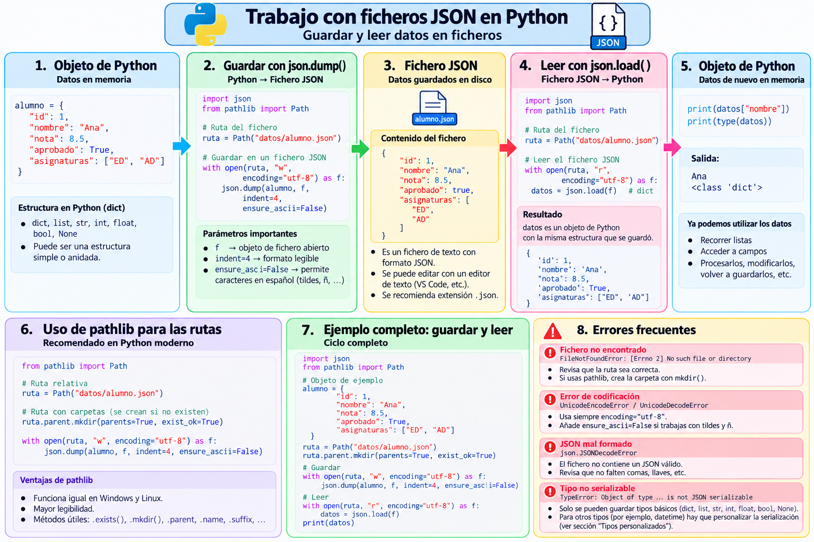

# Guardar y leer ficheros JSON

## 1. Persistencia

Hasta ahora los datos desaparecen al terminar el programa.

Para conservarlos necesitamos un fichero:

```text
estructura Python
       │
       │ json.dump()
       ▼
   alumnos.json
       │
       │ json.load()
       ▼
estructura Python
```
### Mapa visual: ciclo de trabajo con ficheros JSON

El siguiente esquema muestra el proceso completo para guardar una estructura de datos de Python en un fichero JSON y recuperarla posteriormente:




---

## 2. Guardar con `json.dump()`

```python
with open(
    "alumnos.json",
    "w",
    encoding="utf-8"
) as f:
    json.dump(
        alumnos,
        f,
        indent=4,
        ensure_ascii=False
    )
```

---

## 3. ¿Por qué usamos `with`?

`with` utiliza un gestor de contexto y garantiza el cierre del fichero al terminar el bloque, incluso si ocurre una excepción.

```python
with open(...) as f:
    ...
```

es preferible a gestionar manualmente `close()`.

---

## 4. Modo `"w"`

```python
open("alumnos.json", "w")
```

abre el fichero para escritura.

Si ya existe, su contenido se sustituye.

!!! warning
    JSON normalmente representa un documento completo. Añadir fragmentos arbitrariamente con modo `"a"` puede producir un fichero que ya no sea JSON válido.

---

## 5. UTF-8

Usaremos:

```python
encoding="utf-8"
```

y al serializar:

```python
ensure_ascii=False
```

De este modo podemos trabajar correctamente con:

```text
Ángela
Muñoz
Alcalá
```

---

## 6. Pretty printing

```python
indent=4
```

no cambia los datos; únicamente mejora la presentación del fichero.

---

## 7. Ejemplo completo de escritura

```python
import json
from pathlib import Path

def main():
    alumnos = [
        {"nombre": "Ana", "edad": 20},
        {"nombre": "Luis", "edad": 22},
        {"nombre": "Marta", "edad": 19}
    ]

    data_dir = Path("data")
    data_dir.mkdir(
        parents=True,
        exist_ok=True
    )

    fichero = data_dir / "alumnos.json"

    with fichero.open(
        "w",
        encoding="utf-8"
    ) as f:
        json.dump(
            alumnos,
            f,
            indent=4,
            ensure_ascii=False
        )

    print(
        f"Fichero creado: "
        f"{fichero.resolve()}"
    )

if __name__ == "__main__":
    main()
```

---

## 8. Leer con `json.load()`

```python
with fichero.open(
    "r",
    encoding="utf-8"
) as f:
    alumnos = json.load(f)
```

Si el JSON raíz es un array, normalmente obtendremos una lista.

---

## 9. Recorrer los datos

```python
for alumno in alumnos:
    nombre = alumno.get(
        "nombre",
        "(sin nombre)"
    )

    edad = alumno.get(
        "edad",
        "(sin edad)"
    )

    print(
        f"- {nombre} ({edad} años)"
    )
```

---

## 10. Comprobar que existe

Antes de leer:

```python
if not fichero.exists():
    print(
        "El fichero no existe. "
        "Ejecuta primero el programa "
        "que lo genera."
    )
    return
```

---

## 11. Errores que pueden aparecer

### `FileNotFoundError`

El fichero no existe.

### `PermissionError`

No tenemos permiso para acceder.

### `json.JSONDecodeError`

El fichero existe, pero su contenido no es JSON válido.

---

## 12. Lectura robusta

```python
try:
    with fichero.open(
        "r",
        encoding="utf-8"
    ) as f:
        alumnos = json.load(f)

except FileNotFoundError:
    print("No existe el fichero.")

except json.JSONDecodeError as e:
    print("El JSON no es válido.")
    print(e)

except OSError as e:
    print("Error de acceso al fichero:")
    print(e)
```

---

## 13. `dump()` frente a `dumps()`

```python
json.dumps(datos)
```

devuelve texto.

```python
json.dump(datos, fichero)
```

escribe en el fichero.

---

## 14. `load()` frente a `loads()`

```python
json.loads(cadena)
```

interpreta texto.

```python
json.load(fichero)
```

lee e interpreta directamente el contenido del fichero.

---

## 15. Ciclo completo

```text
alumnos: list[dict]
        │
        ▼
   json.dump()
        │
        ▼
 data/alumnos.json
        │
        ▼
   json.load()
        │
        ▼
alumnos: list[dict]
```
