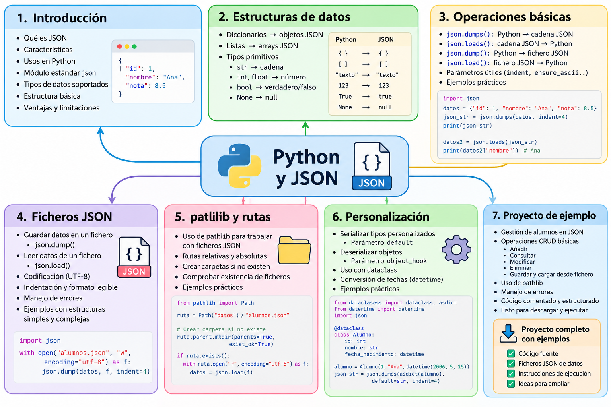
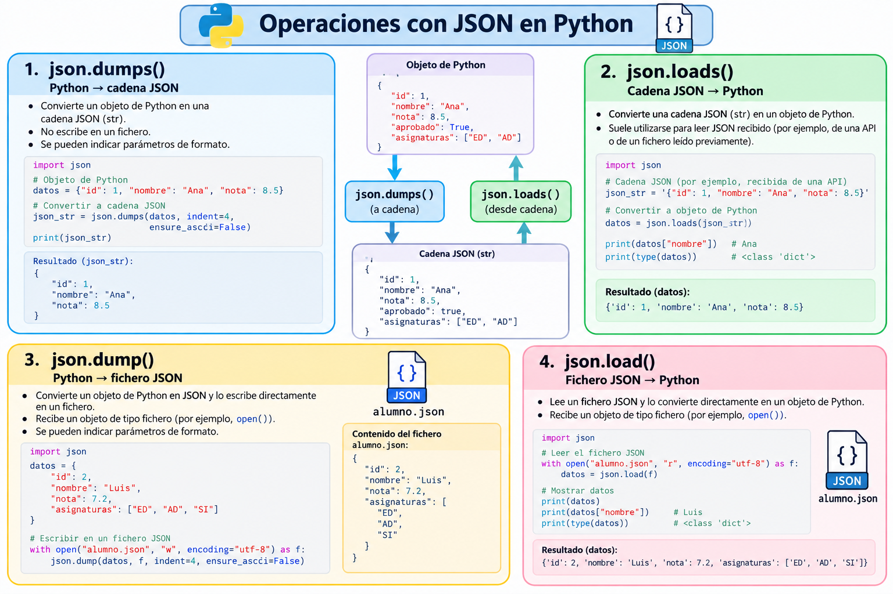

# JSON con Python

## Introducción

Python incorpora soporte para JSON directamente en su **librería estándar** mediante el módulo `json`. A diferencia de Java, no necesitamos añadir una dependencia externa para comenzar a trabajar con este formato.

```python
import json
```

El PDF de la unidad resume las cuatro operaciones fundamentales:

```text
Python → JSON en memoria       json.dumps()
JSON → Python en memoria       json.loads()

Python → fichero JSON          json.dump()
fichero JSON → Python          json.load()
```

El minicurso parte de esas operaciones y las amplía con estructuras anidadas, listas de objetos, `pathlib`, codificación UTF-8, tratamiento de errores y conversión de tipos que JSON no representa de forma nativa.

---

## Mapa conceptual



---

## ¿Por qué JSON es especialmente sencillo en Python?

El módulo `json` trabaja directamente con tipos habituales del lenguaje:

| Python | JSON |
|---|---|
| `dict` | object |
| `list`, `tuple` | array |
| `str` | string |
| `int`, `float` | number |
| `True`, `False` | true, false |
| `None` | null |

Esto hace posible pasar de una estructura Python a JSON sin crear clases intermedias.

```python
alumno = {
    "nombre": "Ana",
    "edad": 20,
    "activo": True
}
```

puede convertirse directamente en:

```json
{
  "nombre": "Ana",
  "edad": 20,
  "activo": true
}
```

---

## Las cuatro funciones que debemos distinguir

### `json.dumps()`

Convierte un objeto Python en una **cadena JSON**.

```python
cadena = json.dumps(alumno)
```

La `s` final puede ayudarnos a recordarlo como *string*.

### `json.loads()`

Convierte una **cadena JSON** en una estructura Python.

```python
alumno = json.loads(cadena)
```

### `json.dump()`

Convierte un objeto Python a JSON y lo escribe directamente en un **fichero**.

```python
json.dump(alumno, fichero)
```

### `json.load()`

Lee JSON directamente desde un **fichero** y devuelve la estructura Python correspondiente.

```python
alumno = json.load(fichero)
```

!!! important
    Una confusión habitual es mezclar `dump` con `dumps` o `load` con `loads`.

    ```text
    dumps / loads → cadenas en memoria
    dump  / load  → ficheros
    ```

---

## Mapa de operaciones



---

## Objetivos del minicurso

Al finalizar deberías ser capaz de:

- importar y utilizar el módulo estándar `json`;
- comprender la correspondencia entre tipos Python y tipos JSON;
- utilizar `dumps()` y `loads()` para trabajar en memoria;
- utilizar `dump()` y `load()` para trabajar con ficheros;
- generar JSON legible mediante `indent`;
- conservar correctamente tildes y caracteres Unicode con `ensure_ascii=False`;
- trabajar con diccionarios, listas y estructuras anidadas;
- utilizar `pathlib.Path` para construir rutas;
- crear directorios antes de escribir un fichero;
- comprobar si un fichero existe;
- tratar errores de lectura y JSON mal formado;
- comprender qué ocurre con tipos no representables directamente en JSON;
- utilizar `default=` y `object_hook` como mecanismos de personalización;
- reconocer cuándo puede resultar útil una `dataclass`.

---

## Proyecto de ejemplos

Todos los ejemplos están reunidos en un proyecto descargable.

[📦 **Descargar proyecto completo de JSON con Python**](../../../descargas/ut1/python-json/python-json-ejemplos.zip)

```text
python-json-ejemplos/
├── README.md
├── data/
│   ├── alumno.json
│   └── alumnos.json
└── src/
    ├── 01_basico_en_memoria.py
    ├── 02_estructuras_json.py
    ├── 03_guardar_alumnos.py
    ├── 04_leer_alumnos.py
    ├── 05_pathlib.py
    ├── 06_errores_json.py
    ├── 07_tipos_personalizados.py
    └── 08_dataclass_json.py
```

!!! tip
    El módulo `json` y `pathlib` pertenecen a la librería estándar de Python, por lo que estos ejemplos no requieren instalar paquetes externos.

---

## Recorrido del minicurso

```text
                     JSON CON PYTHON
                           │
                           ▼
                    1. PREPARACIÓN
                           │
                           ▼
                      import json
                           │
                           ▼
                 2. MEMORIA: dumps/loads
                           │
                           ▼
                3. ESTRUCTURAS PYTHON
                 dict / list / anidados
                           │
                           ▼
                  4. FICHEROS JSON
                    dump() / load()
                           │
                           ▼
                     5. PATHLIB
                  rutas y directorios
                           │
                           ▼
                6. TIPOS PERSONALIZADOS
                default= / object_hook
                           │
                           ▼
                      7. RESUMEN
```

---

## Relación con Java

Después de estudiar JSON con Java podemos establecer estas equivalencias:

| Operación | Gson | Jackson | Python |
|---|---|---|---|
| Objeto → JSON | `toJson()` | `writeValueAsString()` | `json.dumps()` |
| JSON → objeto/estructura | `fromJson()` | `readValue()` | `json.loads()` |
| Escribir fichero | `toJson(obj, writer)` | `writeValue()` | `json.dump()` |
| Leer fichero | `fromJson(reader, tipo)` | `readValue()` | `json.load()` |
| Colecciones | `TypeToken` | `TypeReference` | listas/diccionarios nativos |
| Pretty printing | `setPrettyPrinting()` | pretty printer | `indent=4` |

La diferencia importante es que Python puede trabajar directamente con `dict` y `list`, por lo que para muchos casos sencillos no necesitamos definir un modelo de datos.

---

!!! success "Objetivo final"
    Al terminar podremos realizar el ciclo completo:

    ```text
    estructuras Python
           │
           ▼
          JSON
           │
           ▼
      fichero .json
           │
           ▼
          JSON
           │
           ▼
    estructuras Python
    ```
