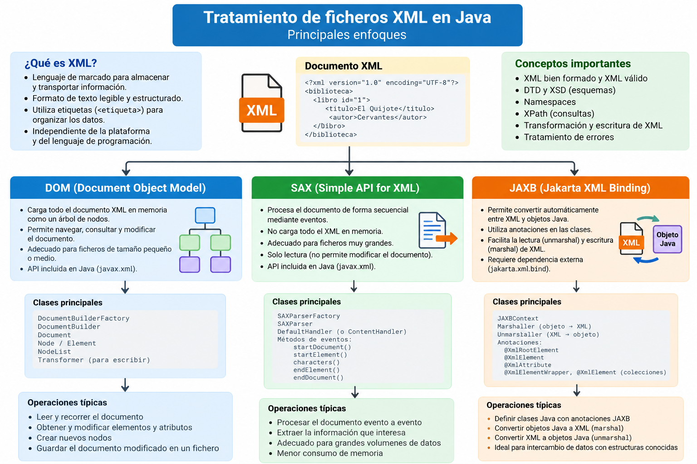

# XML con Java

## Introducción

XML (**eXtensible Markup Language**) es un formato de intercambio de datos basado en etiquetas, atributos y una estructura jerárquica.

En Java podemos trabajar con XML desde varios enfoques:

```text
XML
├── DOM   → árbol completo en memoria
├── SAX   → lectura secuencial mediante eventos
├── XPath → consultas sobre un árbol XML
└── JAXB  → objetos Java ⇄ XML
```

Este minicurso parte de los contenidos de la unidad y los desarrolla con ejemplos progresivos.

## Mapa conceptual

El siguiente esquema resume las principales formas de trabajar con ficheros XML desde Java y las diferencias entre **DOM, SAX y JAXB**:



---

## Mapa del minicurso

Estudiaremos el tratamiento de XML en este orden:

1. Estructura de XML y documentos bien formados.
2. DOM: lectura y navegación.
3. DOM: modificación y escritura.
4. XPath: búsqueda y filtrado.
5. SAX: lectura mediante eventos.
6. JAXB/Jakarta: binding entre objetos Java y XML.
7. Comparativa y criterios para elegir un enfoque.

## ¿Qué puede hacer Java con XML?

| Necesidad | Tecnología |
|---|---|
| Leer un XML completo y navegar libremente | DOM |
| Modificar nodos y guardar cambios | DOM |
| Consultar nodos mediante expresiones | XPath |
| Procesar XML grandes con poca memoria | SAX |
| Convertir objetos Java en XML | JAXB / Jakarta |
| Convertir XML en objetos Java | JAXB / Jakarta |
| Validar estructura | DTD / XSD |

## DOM, SAX y JAXB

### DOM

Carga el documento completo en memoria y lo representa como un árbol de nodos.

```text
Document
└── alumnos
    ├── alumno
    │   ├── @id
    │   ├── nombre
    │   └── edad
    └── alumno
```

Es apropiado cuando necesitamos navegar, modificar o volver a guardar el documento.

### SAX

Procesa el XML secuencialmente y genera eventos:

```text
inicio documento
↓
inicio elemento
↓
texto
↓
fin elemento
↓
fin documento
```

No crea un árbol completo, por lo que consume menos memoria.

### JAXB / Jakarta XML Binding

Permite trabajar directamente con objetos:

```text
XML
   │
   │ unmarshalling
   ▼
Objetos Java
   │
   │ marshalling
   ▼
XML
```

## Objetivos

Al terminar deberías ser capaz de:

- reconocer la estructura de un XML;
- distinguir XML bien formado y XML válido;
- leer XML con DOM;
- recorrer `Document`, `Element`, `Node` y `NodeList`;
- modificar atributos y elementos;
- guardar un DOM mediante `Transformer`;
- realizar consultas con XPath;
- comprender el procesamiento por eventos de SAX;
- implementar un `DefaultHandler`;
- convertir XML ⇄ objetos Java con Jakarta XML Binding;
- decidir cuándo utilizar DOM, SAX, XPath o JAXB.

## Proyecto de ejemplos

Los ejemplos de este apartado están disponibles en un proyecto Maven completo preparado para **Java 21**.

[📦 **Descargar proyecto completo de XML con Java**](../../../descargas/ut1/java-xml/java-xml-ejemplos.zip)

!!! note
    Todos los proyectos Java del material están preparados para **JDK 21**.
